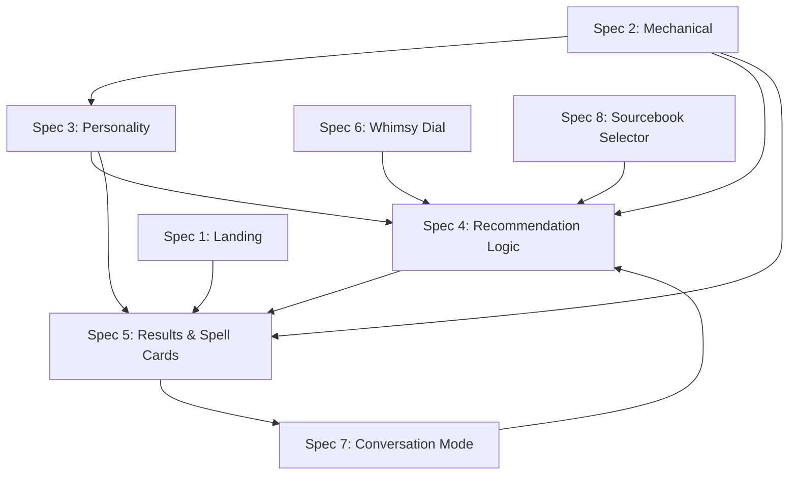

# Specs Index

Canonical map of every spec number to its title, file, and status. Update this file whenever a spec is added, renamed, or renumbered. Any document that refers to a "Spec N" by number must match the mapping below — if it does not, this index is correct and the referencing document is wrong.

See [../spec.md](../spec.md) for the product overview and [MVP-REVIEW.md](MVP-REVIEW.md) for the open-gap audit.

---

## MVP Specs

| # | Title | File | Status |
|---|---|---|---|
| 1 | Prompt Box & Landing | [01-prompt-box-and-landing.md](01-prompt-box-and-landing.md) | Ready |
| 2 | Spell Data — Mechanical Layer | [02-spell-data-mechanical.md](02-spell-data-mechanical.md) | Ready |
| 3 | Spell Data — Personality Layer | [03-spell-data-personality.md](03-spell-data-personality.md) | Ready |
| 4 | Recommendation Logic | [04-recommendation-logic.md](04-recommendation-logic.md) | Ready |
| 5 | Results & Spell Cards | [05-results-and-spell-cards.md](05-results-and-spell-cards.md) | Ready |
| 6 | Whimsy Dial | [06-whimsy-dial.md](06-whimsy-dial.md) | Ready |
| 7 | Conversation Mode | [07-conversation-mode.md](07-conversation-mode.md) | Ready |
| 8 | Sourcebook Selector | [08-sourcebook-selector.md](08-sourcebook-selector.md) | Ready |

All eight specs are needed for the MVP. "Ready" means the prose is written, cross-references are valid, and the canonical visual artefacts exist. Implementation planning is a separate track — see the notes below.

---

## Design Artefacts

### Canonical mocks (full-page compositions)

- [mockups/spec-01-canonical.html](mockups/spec-01-canonical.html) — Landing page.
- [mockups/spec-06-canonical.html](mockups/spec-06-canonical.html) — Whimsy Dial in context (linear rune row along the bottom, dock above).
- [mockups/spec-07-canonical.html](mockups/spec-07-canonical.html) — Conversation / transcript view.
- [mockups/spec-08-canonical.html](mockups/spec-08-canonical.html) — Sourcebook Selector introduced against the Spec 7 flow.
- [mockups/archive/](mockups/archive/) — superseded mocks kept for reference (e.g. `spec-06-canonical-polar-arc.html` predates the linear-row decision).

### Component sheets (isolated states)

Under [mockups/components/](mockups/components/):

- `spell-card.html` — canonical anatomy and every state of a spell card. Source of truth for Spec 5.
- `set-message.html` — italic parchment banner used for set-level context (no exact match, rules answer, etc.).
- `error-card.html` — failure state rendering, with retry.
- `prompt-dock.html` — the prompt scrap / dock.
- `whimsy-dial.html` — the five rune buttons in isolation.
- `casting-circle.html` — the ambient companion circle.
- `transcript-turns.html` — how turns stack in conversation mode.
- `round-counter.html` — round-limit affordance.
- `sourcebook-selector.html` — the book icon + count header control and expanded dropdown. Spec 8.
- `index.html` — component sheet gallery.

Which artefact leads — the prose spec or the component sheet — is **per-spec** and depends on which was authored first. Spec 5 defers to its sheets (which predated the prose); other specs may lead with prose and have their sheets follow. Each spec states its own relationship to its mocks in its opening section.

---

## Dependency Map

- **Spec 2** is the foundation; Specs 3, 4, 5, 8 consume it.
- **Spec 4** is the central feature; Spec 5 renders its output.
- **Spec 7** sits atop Specs 1, 4, 5, 6 — it's the steady-state UX from the first submission onward.

---

## Future / Deferred Specs

Not part of the MVP. Referenced in passing by the MVP specs but not yet written.

| Topic | Referenced in | Status |
|---|---|---|
| Spell combos | Spec 4 (Handling Multiple Spell Recommendations vs Combos) | Deferred — no spec file yet |
| Example prompts / first-run onboarding | Master spec (example queries), MVP-REVIEW §3 | Deferred — own spec eventually |
| Upcast / "At Higher Levels" awareness | Master spec (Future Work) | Deferred — own spec eventually |
| User accounts & login | Spec 1 (header reserves a slot) | Deferred |
| Shareable / URL-addressable queries | Spec 1 out-of-scope | Deferred |
| Analytics & telemetry | Spec 1 out-of-scope | Deferred |
| Server-side sync for dial / theme / sourcebook selection | Specs 6, 8 | Deferred — localStorage for MVP |
| Visual identity pass | Master spec (Future Work) | Deferred — post-MVP polish |
| Recommendation-engine tuning pass | Master spec (Future Work) | Deferred — post-live calibration |
| Whimsy Dial help affordance | Master spec (Future Work) | Deferred — nice-to-have |

Future specs take the next available number when they are written (Spec 9, 10, …). Existing numbers never shift.

---

## Numbering Conventions

- Numbers are **stable**. Once a spec has a number, it keeps it for the life of the project. Do not renumber; if a doc's scope changes, rename within the existing number.
- **Cross-references use the full form**: `[Spec 5](05-results-and-spell-cards.md)` or, when pointing at a section, `[Spec 5](05-results-and-spell-cards.md#loading-state)`. Bare "Spec N" mentions without a link are acceptable only inside paragraphs already densely linked.
- Mermaid node IDs follow the pattern `S<number>[Spec N: Title]`. The number and title must match this index.
- Deferred / not-yet-written specs are never given a number in prose. Refer to them by topic ("spell combos", "upcast awareness") until they are written.

---

## How to Add a Spec

1. Take the next unused number (as of writing: Spec 9).
2. Create `specs/NN-kebab-case-title.md`.
3. Add a row to the MVP Specs or Future/Deferred table above.
4. If the spec introduces new component sheets or canonical mocks, add them to the Design Artefacts section.
5. Update the Dependency Map if the new spec has cross-spec consumers/producers.
6. Grep the repo for any "Deferred" mentions of the topic and update them to point at the new spec.
