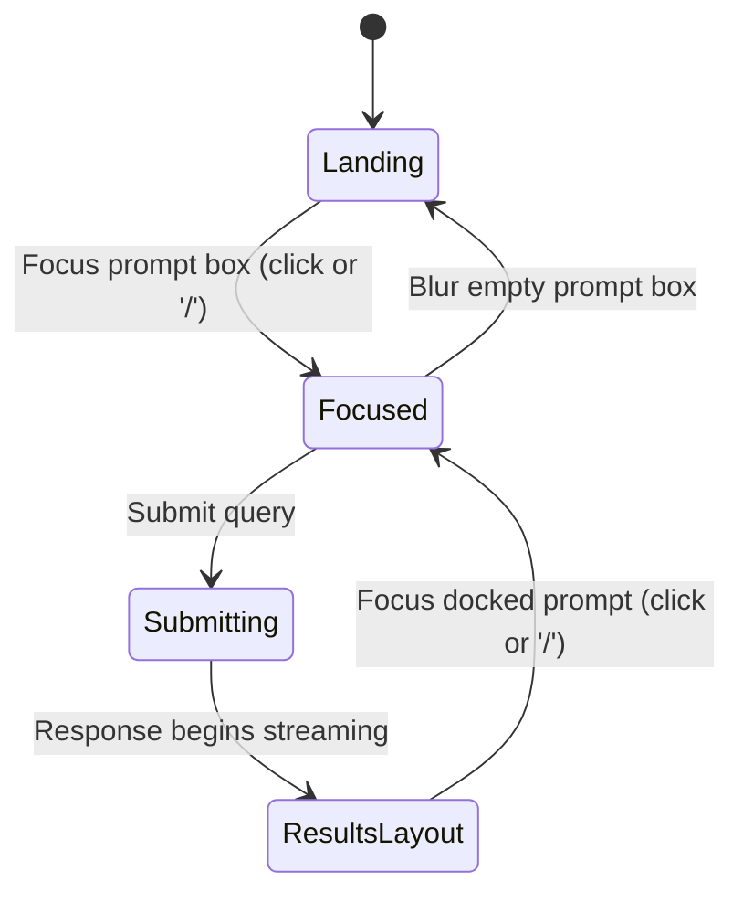

# Spec 1: Prompt Box & Landing Experience

> See [spec.md](../spec.md) for the product overview and [Technical Assumptions](../spec.md#technical-assumptions) for stack details.

---

## Design Artefacts

- **Canonical mock:** [`mockups/spec-01-canonical.html`](mockups/spec-01-canonical.html) — the locked visual direction for the landing experience. Interactive HTML that demonstrates the casting circle, rotating bands, rune glyphs, mandala, unlined scrap, placeholder prompt, and Enter-to-send affordance. This is the reference of record; prose in this spec describes it, not the other way around.
- **Archived explorations:** See `mockups/archive/` for earlier directional studies (A, B, E, F, G, and the K–Z series). These are preserved for historical context but are no longer the canonical direction.

---

## Overview

This is the first screen every user sees. The landing experience has one job: invite the user to type something. The entire page exists to serve the prompt box — everything else is atmosphere and framing.

This spec covers the landing state only. Results rendering is [Spec 5](05-results-and-spell-cards.md); the conversation that begins at the first submit is [Spec 7](07-conversation-mode.md).

---

## Page Structure

The landing page has two main regions:

1. **A header bar** across the top of the page — houses site-level controls and navigation links. Designed to accommodate future additions (e.g., user login, settings).
2. **A centred prompt area** — the prompt box itself, visually prominent and vertically centred in the remaining viewport space.

There is no wordmark, no hero text, no tagline, and no quick-start buttons. The page is deliberately sparse: header, prompt box, atmosphere.

---

## The Header

A slim horizontal bar at the top of the page containing:

- **Navigation links** — placeholders for future pages (e.g., "About," "How it works," "Sourcebooks"). The exact link set is TBD and will be finalized as other features are specced.
- **A theme toggle** — switches between light and dark mode (see Theming below).
- **Login slot (future)** — reserved space on the right side of the header for a future login/account control. Not implemented in the initial version, but the header layout should reserve the slot so adding it later doesn't require redesign.

The header is visually distinct from the main canvas but consistent with the overall aesthetic (see Visual Design Direction below). It persists into the results state.

---

## The Prompt Box

A single, large text input centred on the page. No labels, no surrounding form controls. The input is visually prominent — it should feel like the main character of the page.

### Content

- The input accepts freeform text.
- It has static placeholder text showing one example query (e.g., *"The owlbear we tracked has cubs. Combat seems cruel. Can we pacify or redirect it without bloodshed?"*). The sample prompt lives in the placeholder only — the field is never pre-filled with text the user has to clear. Placeholder rotation is **deferred** — see "Deferred: Rotating Placeholder Pool" below.
- Submission is via **Enter**. `Shift+Enter` inserts a newline. There is no submit button — the interaction is modelled after sending a text message.
- A small "Send ↵" affordance in the bottom-right of the scrap communicates the Enter-to-send contract. It is muted when the field is empty and brightens once the user has typed something.
- Submitting an empty input does nothing.
- While a request is in flight, the input is disabled and a subtle loading treatment is applied.

### Keyboard Shortcut

The `/` key, pressed anywhere on the page (outside of another input), focuses the prompt box. This works on both the landing state and the results state, making the prompt quickly reachable at all times.

---

## Visual Design Direction

The aesthetic draws from the material world of a working wizard: **leather-bound tomes, thick roughly-cut paper, calligraphy, illuminated text, notes in the margins, colourful felt and satin ribbons as bookmarks, feather quills for writing, maps and spell scrolls, colourful potions in glass bottles, and the flittering glow of magic.**

The design should feel tactile and handcrafted. It is not a minimal tech product with a dark theme — it is a tool that looks like it was bound in a leatherworker's shop and inked by a calligrapher. Ornament is encouraged, provided it doesn't compromise legibility or usability.

### Colour Palette

Rather than black/white, the palette is **wood-toned**:

- **Dark mode (default):** Deep oak, walnut, aged leather. Warm browns, deep charcoals with warm undertones, brass and candlelight accents.
- **Light mode:** Lighter woods (maple, ash), tan and cream paper tones, faded ink, muted gold.

The two modes are not simple inversions — each has its own character. Dark mode is evening in the study by candlelight; light mode is afternoon at a writing desk by a window.

Accent colours (for interactive highlights, magical glow effects, ribbon details) may include: amber/gold, deep crimson, forest green, ink blue. These should appear sparingly, like the coloured inks of an illuminated manuscript.

### Typography

- **Body text:** A readable serif that evokes printed books without being a pastiche (e.g., a high-quality text serif with good screen rendering).
- **Input text / prompts:** May use a slightly more distinctive serif or a hand-calligraphic treatment to reinforce the "you're writing in a book" feeling, provided readability is preserved.
- **Decorative elements:** Display or calligraphic fonts used sparingly for headers, drop caps, or ornamental flourishes.

### Material and Texture

- Paper texture with visible grain and subtle imperfections.
- Leather textures for bordering and framing elements.
- Ink bleeds, edge wear, and subtle shadows where they reinforce the metaphor.
- Magic glow effects (a soft luminance, particle hints) reserved for the prompt box and interactive moments — used to suggest arcane energy without becoming gaudy.

### Canonical Mockup

The chosen visual direction is **[Spec 1 — Landing & Prompt Box](mockups/spec-01-canonical.html)**: a large, slowly rotating arcane casting circle dominates the viewport, with an unlined scrap of vellum pinned at its centre holding the prompt input.

The casting circle is the visual centrepiece:

- **Three concentric rotating bands**, each turning at a different speed and direction, giving the illusion of a living, ritually-tuned instrument. Outer band: a tick-marked degree ring (5° minor / 15° major ticks) bordered by thin brass lines. Middle band: twelve zodiacal sectors divided by spoke lines, each sector engraved with an Elder Futhark rune glyph. Inner band: a twelve-point mandala built from overlapping triangles and radial spokes.
- **A concentric core** of nested circles converging on a small glowing centre, behind the scrap.
- **A soft radial halo** pulsing gently behind the whole circle, establishing the arcane mood.
- **Default glow colour is warm gold** — a neutral "ready" state. (In [Spec 6](06-whimsy-dial.md) the glow colour swaps to match the selected whimsy level.)

The **scrap of vellum** floating at the centre:

- Unlined. Torn / deckle-edged via `clip-path`. Mottled parchment texture from layered radial gradients — no ruled lines, no baseline guides.
- Slight rotational tilt (~-1.5°) to feel hand-placed rather than grid-aligned.
- Holds the textarea. The only in-scrap UI is the small "Send ↵" affordance described above.

The surrounding canvas is deep oak / candlelit shadow (radial gradient from warm brown at the centre to near-black at the edges), with a faint vertical grain pattern overlaid.

This mockup establishes **layout, composition, and mood**. Specific SVG artwork (rune glyphs, tick counts, mandala point count) is scaffolding — a dedicated visual identity pass (tracked in [spec.md](../spec.md#optional--deferred-features)) will refine the exact graphics and typography later. The compass needle and whimsy-level symbols visible in sibling mockups are **not** part of Spec 1 — they belong to [Spec 6](06-whimsy-dial.md).

Earlier directional explorations (B — Wizard's Desk, E — Open Tome on Desk, F — Scrap of Paper, G — Page Close-Up, and the L–Z mockup series) live in the `mockups/` subdirectory for reference but are not the canonical design.

---

## Theming (Light / Dark Mode)

- Dark mode is the default.
- A header toggle switches between modes.
- The user's preference persists for the session.
- Both modes use the wood-toned palette described above — not a simple black-to-white swap.
- Colour tokens should be defined in CSS custom properties / Tailwind theme config so adding additional themes later (e.g., a campaign-specific theme) is straightforward.

---

## Layout Sketch

```
┌───────────────────────────────────────────────────────────┐
│  [ nav link ] [ nav link ]              [theme] [login?]  │  ← Header
├───────────────────────────────────────────────────────────┤
│                                                           │
│                   .·:*¨¨*:·.                              │
│                .·´             `·.                        │
│              ·´    casting circle   `·                    │
│             ·     ┌─────────────┐     ·                   │
│             ·     │  prompt     │     ·                   │
│             ·     │   scrap     │     ·                   │
│             ·     └─────────────┘     ·                   │
│              ·.                     .·                    │
│                `·.               .·´                      │
│                   `·:*_______*:·´                         │
│                                                           │
└───────────────────────────────────────────────────────────┘
```

The casting circle is vertically centred in the space below the header, sized to dominate the viewport (~900×900 on desktop). The unlined scrap floats at the circle's geometric centre.

---

## Transition to Results State

When the user submits a query, the landing page transforms into the results layout.

### What Happens

1. The prompt box **animates upward** from its centred position, docking into the header area (or just beneath it — TBD based on chosen visual direction).
2. The area below becomes the results container, where spell cards render (see [Spec 5](05-results-and-spell-cards.md)).
3. The header remains visible throughout.

### Prompt Box in Results State

Once docked, the prompt box:

- Retains full functionality — the user can submit a new query or a follow-up at any time.
- Shows the current/previous query as its value.
- Is always visible, never scrolls off screen.
- Remains focusable via the `/` shortcut.

The prompt remains the primary interaction throughout the session, not just on landing.

---

## Loading State

After submission and before results arrive:

- The prompt box shows a subtle animation — a gently pulsing glow, shimmering ink, or animated quill replacing the submit affordance.
- No full-page spinner. The transition to results layout can begin immediately, with placeholder card skeletons appearing below (see [Spec 5](05-results-and-spell-cards.md#loading-state) for skeleton behaviour).
- If the request takes longer than ~5 seconds, a short flavourful message fades in (e.g., *"Consulting the spellbooks..."*) instead of a generic "Loading."

---

## Responsive Behaviour

- **Desktop (≥1024px):** Prompt box is roughly 60% of viewport width. Full header layout.
- **Tablet (768–1023px):** Prompt box widens to ~80% of viewport width. Header may condense nav links into a menu.
- **Mobile (<768px):** Prompt box is nearly full-width with comfortable horizontal padding. Header collapses nav links into a hamburger or overflow menu. Ornamentation may simplify on small screens to preserve clarity.

---

## State Diagram



---

## Behaviour Summary

| Scenario | Behaviour |
|---|---|
| Page loads | Header visible, prompt box centred, static placeholder shown |
| User presses `/` | Prompt box is focused (if not already) |
| User focuses input | Cursor appears, any loading/idle animation pauses or adapts |
| User submits empty input | Nothing happens |
| User submits query | Transition to results layout, loading state shown |
| Theme toggle clicked | Light/dark mode swaps, preference persists for session |
| Results arrive | Spell cards render below (see [Spec 5](05-results-and-spell-cards.md)) |
| User submits from docked prompt | New results replace previous |

---

## Accessibility

Inherits the [master spec's Accessibility Baseline](../spec.md#accessibility-baseline). Landing-specific notes:

- The landing layout is a single tabbable sequence: header controls (in source order), then the prompt textarea, then the submit affordance. The `/` keyboard shortcut focuses the textarea from anywhere on the page and is documented via a hidden hint for screen-reader users.
- The prompt textarea has a visible, descriptive `<label>` (or `aria-label` if the label is purely decorative). The placeholder is not a substitute for the label.
- The landing → conversation transition respects `prefers-reduced-motion`: the vellum-fade / casting-circle settle animation collapses to an instant state change when reduced motion is preferred.
- The casting circle artwork is marked `aria-hidden="true"` at every theme, per the baseline.
- The theme toggle announces its new state on activation (e.g., "Theme: dark").

---

## Out of Scope for This Spec

The following are explicitly *not* part of Spec 1 and are handled by later specs or deferred work:

- **LLM integration.** Submission uses a stubbed handler that simulates a delay and transitions to a placeholder results state. No real recommendation logic yet.
- **Spell data.** No database, no spell records, no sourcebook selector.
- **Results rendering.** The results view is a stub destination for the submit transition — actual spell cards, explanations, and interactions are owned by [Spec 5](05-results-and-spell-cards.md).
- **User accounts and login.** The header reserves a login slot but does not implement authentication.
- **Shareable / URL-addressable queries.** The landing and results states are not URL-distinct in this spec.
- **Conversation mode and follow-ups.** Owned by [Spec 7](07-conversation-mode.md).
- **Analytics and telemetry.** Not part of this initial slice.
- **Functional header nav links.** Placeholder links only; their destinations are defined as other specs introduce them.

## Resolved Design Decisions

- **Canonical visual direction:** Arcane casting circle + unlined scrap of vellum. See `mockups/spec-01-canonical.html`. Layout, composition, and mood are locked; specific artwork (rune choices, tick counts, mandala geometry) is scaffolding pending a dedicated visual identity pass.
- **Submit affordance:** No button. Enter submits; `Shift+Enter` inserts a newline. A muted "Send ↵" hint in the scrap's bottom-right corner brightens when the field has content.
- **Example prompt as placeholder:** The sample prompt appears only as placeholder text. The input is never pre-filled with content the user must delete.
- **Header contents:** Structure confirmed (nav on the left, theme toggle + login slot on the right). Exact link set is TBD and will be finalized as other specs define their entry points.
- **Theme persistence:** On first visit, respect the system `prefers-color-scheme` setting. After the user interacts with the theme toggle, store their choice (session-scoped) and prefer it over the system setting for the rest of the session.
- **Mobile ornamentation:** Mobile layouts may demand less ornamentation than desktop. Decorative elements (scattered desk items, corner flourishes, marginalia) should gracefully simplify or drop out at narrow widths, preserving the core prompt box and header as the essentials.
