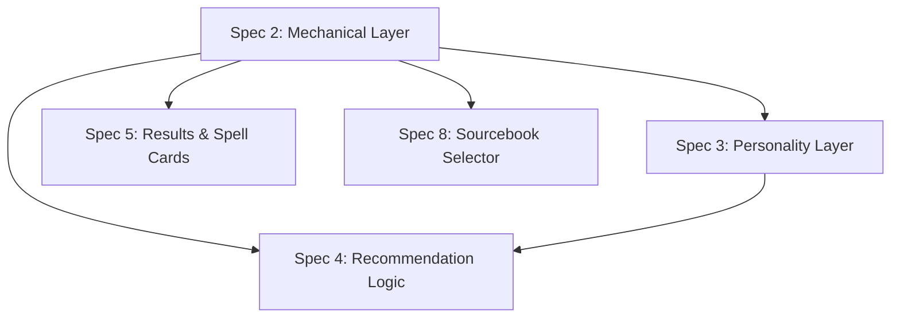

# Spec 2: Spell Data — Mechanical Layer

> See [spec.md](../spec.md) for the product overview. This spec covers **Layer 1: Mechanical Properties** from the "Spell Knowledge: Two Layers" section.

---

## Overview

Before the system can recommend a spell, it needs to *know* the spell. This spec defines the mechanical layer of that knowledge — the objective, rules-based data about each wizard spell that downstream features (filtering, scoring, results display) will rely on.

This is the foundation. It is not sufficient on its own to power recommendations — the interpretive "personality" layer (Spec 3) does the heavier lifting for stylistic fit — but it is *necessary*. Every hard-constraint filter, every mechanical-fit score, and every spell card rendering depends on this data being complete, accurate, and well-structured.

This spec focuses on **what data exists and what it means**, not on how it gets displayed, edited, or consumed. It is a data-layer spec.

---

## What This Spec Delivers

When this spec is complete, the system has:

1. A populated store of wizard spells from all in-scope official sourcebooks.
2. For each spell, a full set of mechanical attributes captured in a consistent, queryable structure.
3. The full original descriptive text of each spell, preserved verbatim.
4. Sourcebook attribution for each spell.
5. The ability to look up, filter, and list spells by any mechanical attribute.

It does **not** deliver a user-facing interface for browsing spells, an admin editor, or any recommendation logic. Those belong to other specs.

---

## Scope: Wizard Spells Only

The initial data set includes only spells that appear on the **Wizard spell list**, across cantrips through 9th-level spells, from the in-scope official sourcebooks listed in [spec.md](../spec.md#sourcebook-selector).

Each spell carries a **class availability** attribute (see below) so that when the product later expands beyond Wizard, the same data store can absorb additional class lists without restructuring.

Unearthed Arcana, playtest material, and homebrew are excluded and cannot be enabled.

---

## Spell Attributes

Each spell record captures two categories of information: **identity and rules-text**, and **structured mechanical attributes**.

### Identity and Rules Text

These establish what the spell *is* and preserve its canonical description.

- **Name** — the spell's published name.
- **Source** — the sourcebook the spell is published in (e.g., PHB/XGE/TCE/FTD/SCC).
- **Class availability** — the list of classes whose spell lists include this spell. For the initial data set this always includes Wizard, but may also include other classes.
- **Full description text** — the spell's complete rules text as published, preserved verbatim. This is what the user sees when they expand a spell card, and it is the raw input that the personality layer (Spec 3) interprets.

### Structured Mechanical Attributes

These are the queryable, filter-ready fields derived from the published stat block and rules text.

- **Level** — 0 (cantrip) through 9.
- **School of magic** — abjuration, conjuration, divination, enchantment, evocation, illusion, necromancy, transmutation.
- **Casting time** — with enough structure to distinguish actions, bonus actions, reactions (including the reaction trigger), and longer casting times (minutes, hours, rituals).
- **Range** — captured as both a human-readable string ("120 feet," "Self (30-foot cone)") and a structured form sufficient to filter by distance and targeting shape.
- **Components** — verbal, somatic, material flags, plus the material component's description and any cost / consumed status.
- **Duration** — captured as both a readable string and a structured form that distinguishes instantaneous, concentration, and timed durations (with the time value).
- **Concentration** — boolean.
- **Ritual** — boolean.
- **Damage** — when the spell deals damage: damage type(s), base dice/amount at the spell's native level, and whether the damage is conditional (e.g., "on a failed save, half on success").
- **Saving throw** — which ability score is saved against, and the effect on success/failure at a high level.
- **Attack roll** — whether the spell requires an attack roll, and its type (melee/ranged, spell).
- **Conditions inflicted** — any conditions the spell can impose (charmed, frightened, prone, restrained, etc.).
- **Area of effect** — shape (cone, cube, cylinder, line, sphere, etc.) and size, when applicable.
- **Targeting** — one or more tags from the Targeting controlled vocabulary below. Orthogonal to combat role.
- **Combat role** — one or more tags from the controlled vocabulary below. Multi-tagging is encouraged (Fireball is both `damage` and `control`).
- **Out-of-combat utility** — one or more tags from the controlled vocabulary below. Multi-tagging is encouraged.
- **Action economy category** — a derived tag describing how the spell fits into a turn.
- **Duration category** — a derived tag bucketing duration into coarse classes.

See **Controlled Vocabularies** below for the full tag lists.

The structured forms exist so the system can answer questions like *"3rd-level spells that deal cold damage in a cone"* or *"non-concentration spells that last longer than 10 minutes"* without re-parsing rules text at query time.

---

## Controlled Vocabularies

These are first-pass vocabularies. They are expected to be tuned against real spell data during and after initial population.

### Combat Role

- `damage` — the spell deals damage. Targeting shape (single-target, area-of-effect, multi-target) is captured separately in the Targeting vocabulary.
- `control-hard` — removes a target's ability to act (paralyzed, stunned, unconscious, incapacitated, etc.).
- `control-soft` — shapes the battlefield or hampers without fully removing agency (difficult terrain, obscurement, prone, grappled, restrained-light, movement denial).
- `control` — a parent grouping that matches both `control-hard` and `control-soft`. Queries for "control" should return spells tagged with either sub-tag. The parent tag is not applied directly.
- `buff` — improves an ally's capabilities.
- `debuff` — weakens an enemy without necessarily removing their ability to act.
- `healing` — restores hit points or removes conditions. (Retained for forward-compatibility with non-wizard classes even though few wizard spells qualify.)
- `movement` — enables or enhances movement (teleport, fly, misty step, dimension door).
- `defense` — protects against harm (shields, resistances, saves bonuses).
- `summoning` — calls creatures or conjured allies.
- `divination` — reveals information, detects, scries, or senses.
- `utility` — catchall for effects that don't fit the above (often paired with more specific tags).

### Targeting

Targeting is an orthogonal concept from combat role. A spell carries a combat role *and* a targeting tag (or tags) independently. Fireball is `damage` + `area-of-effect`. Magic Missile is `damage` + `multi-target`. Ray of Frost is `damage` + `single-target`.

- `single-target` — affects one creature or object.
- `multi-target` — affects multiple specific creatures or objects chosen by the caster, without filling an area (Magic Missile, Scorching Ray, Chromatic Orb's jump on an upcast).
- `area-of-effect` — affects everything within a defined shape (cone, cube, cylinder, line, sphere, wall, etc.). AoE shape and size are captured in the separate Area of Effect field.
- `self` — affects only the caster.
- `touch` — requires physical contact with the target.

### Out-of-Combat Utility

- `exploration` — traversing, uncovering, or interacting with the environment (Find the Path, Passwall, Stone Shape).
- `travel` — long-distance movement (Teleport, Tree Stride, Wind Walk). Spells that serve both should carry both `exploration` and `travel`.
- `movement` — short-range or tactical movement outside of combat (Spider Climb, Levitate when used for access). Distinct from `travel` and `exploration`.
- `social` — influences or aids interaction with creatures (Charm Person, Suggestion, Friends).
- `investigation` — examining, analyzing, or questioning (Detect Thoughts, Speak with Dead, Legend Lore).
- `information-gathering` — reveals information about the world (Detect Magic, Identify, Comprehend Languages, Scrying).
- `stealth` — supports hiding, sneaking, or disguise (Invisibility, Disguise Self, Pass Without Trace).
- `crafting` — creates, shapes, or repairs objects (Fabricate, Mending).
- `communication` — enables contact across distance or barriers (Sending, Message, Animal Messenger).

A spell may carry both a combat-role `divination` tag and an out-of-combat `information-gathering` tag — they address different query contexts.

### Action Economy Category

- `action` — cast with a standard action.
- `bonus-action` — cast with a bonus action.
- `reaction` — cast as a reaction. The specific trigger is captured in the description text, not as a separate tag.
- `ritual` — has the ritual tag (may still be cast as an action in combat; ritual is an additional capability).
- `long-cast` — any casting time of 1 minute or longer, which for practical purposes means the spell cannot be cast in combat.

### Duration Category

- `instantaneous` — the spell resolves immediately.
- `short` — up to and including 1 minute.
- `medium` — longer than 1 minute, up to and including 1 hour. A 10-minute duration lives here.
- `long` — longer than 1 hour, up to and including 8 hours. An 8-hour duration lives here.
- `permanent` — lasts until dispelled, triggered, or otherwise ended by specific conditions.

Concentration is **not** compounded into duration category. It is kept as a separate boolean field. Queries that care about "1-minute concentration spells" filter on both `duration-category = short` and `concentration = true`.

---

## Data Sources

Spell content is populated from **official published sources** only: PHB/XGE/TCE/FTD/SCC, and any other official sourcebooks containing wizard spells. For all spells — SRD and non-SRD alike — the full verbatim description text is captured and stored, so the user's expanded-card experience is uniform across sources. This is appropriate for the tool's current scope as a personal project; if the product is ever published more broadly, licensing constraints on non-SRD text will need to be revisited before that happens.

The canonical source for scraping is the wizard spell index at `https://dnd5e.wikidot.com/spells:wizard` and the per-spell pages it links to.

---

## Data Quality Requirements

The mechanical layer is load-bearing — a wrong saving throw or missed condition tag degrades every downstream recommendation. The following quality bars apply:

- **Completeness.** Every wizard spell from every in-scope sourcebook is present. No silent omissions.
- **Accuracy.** Every mechanical attribute matches the published stat block. This is verified against the source material, not inferred.
- **Internal consistency.** Controlled-vocabulary fields (school, damage type, condition names, combat-role tags, etc.) use exactly one spelling and casing each. A spell does not carry both "cold" and "Cold" as damage types.
- **Verifiability.** Each record is traceable back to its source (sourcebook + page or section reference), so errors can be found and fixed.
- **No rules interpretation in structured fields.** When a spell's text is ambiguous, the structured fields capture only what is explicitly stated. Interpretation and nuance belong in the personality layer (Spec 3), never in the mechanical layer.

---

## Populating the Data

The initial population is a one-time automated effort. It happens in two stages:

1. **Scrape** the wizard spell index and per-spell pages from `https://dnd5e.wikidot.com/spells:wizard`. Extract the fields that are directly available on the page: name, level, school, casting time string, range string, components, duration string, concentration, ritual, class availability, and full description text. Store the result as one YAML file per spell.
2. **Derive the interpreted fields** from each spell's description using an LLM-assisted extraction pass. This fills in the structured damage breakdown, saving-throw details, attack type, conditions inflicted, area-of-effect shape/size, targeting, combat-role tags, out-of-combat-utility tags, action-economy category, and duration category. The extraction output is written back into the same YAML files for review and correction.

Neither stage requires manual authoring per spell. Human review is expected on the LLM-derived fields — especially the tag fields — as part of the vocabulary-tuning pass, but the goal is that review is a scan-and-correct operation rather than original authoring.

Subsequent updates — corrections, newly-released sourcebooks, expansion to other classes — can re-run the same pipeline on new source URLs.

---

## Extensibility

Two dimensions of future growth must not require schema reshuffling:

- **Additional classes.** When the product expands beyond Wizard, new spells are added and existing spells' `class availability` lists are updated. No other structural change is required.
- **Additional sourcebooks.** When a new official sourcebook releases, its wizard spells are authored into the same store with the new source tag. The [Sourcebook Selector (Spec 8)](08-sourcebook-selector.md) picks up the new option automatically from the data.

The personality layer (Spec 3) attaches to the same spell records but is spec'd and populated separately. Mechanical data can be complete and usable before any personality data exists.

---

## Relationship to Other Specs

Spec 2 is a hard dependency for Specs 3, 4, 5, and 8. Nothing downstream can ship without it.

---

## Out of Scope for This Spec

The following are explicitly *not* part of Spec 2 and are handled by later specs or deferred work:

- **User-facing spell browser or search UI.** No page where users look up a spell by name. The data is queryable internally but not exposed directly.
- **Admin or authoring UI.** Spell records are authored directly into the data store during the initial population effort. A dedicated CMS or admin interface is not required at this stage.
- **The personality layer.** Sensory signature, emotional tone, dramatic potential, and the other interpreted facets are covered by Spec 3.
- **Recommendation logic.** How the system scores and selects spells is covered by Spec 4.
- **The sourcebook selector UI.** The data carries source attribution; the user-facing control for enabling/disabling sources is [Spec 8](08-sourcebook-selector.md).
- **Non-wizard classes.** Schema supports class availability; populating other class lists is future work.
- **Upcast scaling awareness.** The system does not reason about how spells change when cast with higher-level slots. Users make their own judgements. Tracked as a deferred feature in [spec.md](../spec.md#optional--deferred-features).
- **Spell images or artwork.** Not part of the data model.
- **Homebrew, UA, or playtest content.** Permanently excluded.

---

## Resolved Design Decisions

- **Scope is wizard-first.** Only wizard spells are authored initially, but every record carries a class-availability list so expansion is purely additive.
- **Official sources only.** PHB/XGE/TCE/FTD/SCC and other official sourcebooks with wizard spells. No UA, no playtest, no homebrew — ever.
- **Two layers, separate specs.** Mechanical data (this spec) and personality data (Spec 3) share the same spell records but are authored, validated, and specced independently. Mechanical data must be complete before personality data is useful.
- **Structured and readable forms coexist.** Attributes like range and duration are captured both as human-readable strings (for display) and structured values (for filtering). The system is not forced to re-parse rules text at query time.
- **Full verbatim description text is preserved for all spells.** Including non-SRD sources. The tool is a personal project for now; broader publication would require revisiting licensing before it goes public.
- **Automated scrape + LLM extraction.** Spell data is populated by scraping `https://dnd5e.wikidot.com/spells:wizard` and its linked pages for factual stat-block data, then running an LLM-assisted extraction pass over each description to derive the interpreted fields (damage breakdown, saves, conditions, AoE, targeting, role and utility tags, action-economy and duration categories). Human review is expected on the LLM-derived fields but not on the scraped fields.
- **First-pass vocabularies are drafted in this spec.** The Controlled Vocabularies section above is the initial vocabulary. It will be tuned after real data exists; tag additions and refinements are expected.
- **Multi-tagging is encouraged.** A spell carries every role and utility tag that meaningfully applies. No "pick one dominant role" constraint.
- **Control splits hard / soft, with a parent grouping.** Spells are tagged `control-hard` or `control-soft` (or both); queries for `control` match both. The parent tag is not applied directly.
- **Targeting is orthogonal to combat role.** Targeting tags (`single-target`, `multi-target`, `area-of-effect`, `self`, `touch`) are their own vocabulary and apply to any spell, not just damage spells. Fireball is `damage` + `area-of-effect`; Magic Missile is `damage` + `multi-target`; Hold Person is `control-hard` + `single-target`.
- **Reaction is one tag; triggers are in description text.** The reaction trigger (e.g., "when a creature within 60 feet casts a spell") is not extracted into a structured field.
- **1 minute or longer = too long for combat.** All casting times of 1 minute or more collapse into `long-cast`, regardless of whether they are 1 minute, 10 minutes, or an hour.
- **Duration category and concentration are separate axes.** Concentration stays a boolean. Duration category does not compound concentration into its values.
