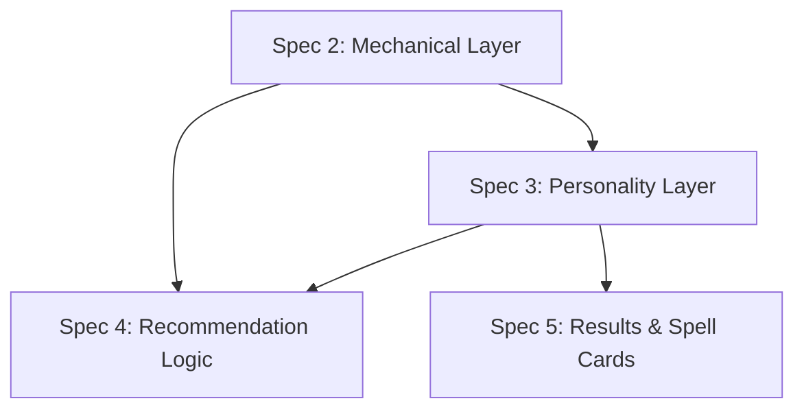

# Spec 3: Spell Data — Personality Layer

> See [spec.md](../spec.md) for the product overview. This spec covers **Layer 2: Spell Personality (Interpreted Data)** from the "Spell Knowledge: Two Layers" section. It builds on [Spec 2](02-spell-data-mechanical.md), which defines the mechanical layer.

---

## Overview

The mechanical layer (Spec 2) tells the system what a spell *does*. The personality layer tells it what a spell *feels like*. This is the difference between "Fireball deals 8d6 fire damage in a 20-foot sphere" and "Fireball is the loudest, most satisfying, most incautious thing a wizard can do — a roaring orange detonation that announces your presence to everything in the dungeon."

Without this layer the system can answer "what 3rd-level spell deals the most damage in an area" but not "what spell feels like a furious god standing in the middle of a wildfire they started on purpose." The personality layer is what lets Arcane Advisor match stylistic, mood-based, and character-identity queries — the heart of what distinguishes it from a rules database.

This is an interpretive layer. Every field in it is a judgement call. That is expected and intentional.

---

## What This Spec Delivers

When this spec is complete, each spell record carries, alongside its mechanical data:

1. A set of tagged personality attributes across the seven facets below.
2. A short prose personality blurb that supports semantic matching beyond what tags capture.
3. A small number of numeric personality scores for facets where a spectrum is more useful than tags.

The personality data is queryable and scoreable by the recommendation logic (Spec 4), but is not directly surfaced to the user as a browse-by-tag interface. It shows up through the "why this spell" explanations and tag labels on spell cards (Spec 5).

---

## The Seven Facets

The personality layer decomposes each spell into seven facets, mirroring the structure in [spec.md](../spec.md). Each facet captures a different *kind* of subjective truth about the spell.

### 1. Sensory Signature

What the spell looks, sounds, smells, and feels like in the moment of casting. This is the raw sensory footprint — before any meaning or mood is attached.

Captured as: a small set of sensory tags (see Controlled Vocabularies below) **plus** a one-to-two-sentence prose description of the sensory experience.

### 2. Emotional Tone

The feeling the spell evokes in the caster, the target, and any witnesses. Not the mechanical effect — the *mood*.

Captured as: one or more emotional-tone tags (triumphant, sinister, whimsical, melancholy, etc.) plus, where useful, a brief prose note about *why* the spell lands this way.

### 3. Dramatic Potential

How much of a spectacle the spell is, and how much room it leaves for memorable moments.

Captured as: a numeric score from 1 to 5, plus a short prose note about the spell's "best dramatic moment." Dramatic potential is partially inherent (Meteor Swarm is always dramatic) and partially contextual (Counterspell is only dramatic when timed right) — the prose captures the conditional case.

### 4. Physicality and Scale

The physical scope of the spell's effect. Is it a scalpel or a wrecking ball? Does it alter a body, a room, or a landscape?

Captured as: one or more scale tags (surgical, architectural, geological, etc.) plus, where useful, a short prose note.

### 5. Cleverness Factor

How much the spell rewards creative or unusual applications. A spell with a high cleverness factor is one the user should be *thinking sideways* about.

Captured as: a numeric score from 1 to 5, plus a short prose note with one or two example creative applications.

### 6. Social and Roleplay Flavor

The spell's narrative utility outside of combat — its presence in conversations, character moments, and roleplay scenes.

Captured as: one or more social/roleplay tags (see Controlled Vocabularies) plus, where useful, a short prose note.

### 7. Aesthetic and Fantasy Archetype

The kind of wizard the spell makes you feel like. This crosses school boundaries — both Lightning Bolt and Witch Bolt are evocation lightning, but they belong to very different wizards.

Captured as: one or more archetype tags (see Controlled Vocabularies) plus a short prose note.

---

## Capture Format

Each facet uses one of three data shapes:

- **Tagged facets** (sensory signature, emotional tone, physicality/scale, social/roleplay, aesthetic/archetype) — one or more tags from a controlled vocabulary, with optional prose.
- **Scored facets** (dramatic potential, cleverness factor) — an integer from 1 to 5, with a short prose note explaining the score.
- **Personality blurb** — every spell also has a prose blurb that captures the spell's overall character in plain language. Aim for 2–4 sentences as a default, but complex or nuanced spells (Magic Jar, Wish, Simulacrum, True Polymorph, and the like) may need a paragraph or two to do justice to their strange corners. Length is driven by how much the spell actually has to say, not by a fixed target. This is what the recommendation layer uses for semantic matching against natural-language queries, and what the "why this spell" explanation engine draws from.

The blurb is the single most important piece of personality data. Tags narrow and filter; the blurb carries voice.

---

## Controlled Vocabularies

These are first-pass vocabularies, drafted from the product spec and expected to be tuned once real LLM-extracted data is reviewed. Multi-tagging is encouraged everywhere.

### Sensory Signature

Each spell may carry tags across up to five sensory axes. A spell does not need tags on every axis — only where the axis is a meaningful part of its signature.

- **Sight:** `bright`, `dark`, `colourful`, `monochrome`, `shimmering`, `pulsing`, `formless`, `geometric`, `organic`, `incorporeal`, `invisible`.
- **Sound:** `loud`, `quiet`, `silent`, `roaring`, `whispering`, `musical`, `discordant`, `humming`, `crackling`.
- **Temperature/feel:** `hot`, `cold`, `electric`, `damp`, `dry`, `heavy`, `weightless`, `tingling`.
- **Smell/air:** `ozone`, `smoke`, `rot`, `sweet`, `metallic`, `clean`, `earthy`.
- **Presence:** `subtle`, `overt`, `uncanny`, `intimate`, `vast`.

### Emotional Tone

- `triumphant`, `sinister`, `whimsical`, `melancholy`, `serene`, `menacing`, `awe-inspiring`, `comedic`, `eerie`, `tender`, `righteous`, `desperate`, `playful`, `dignified`, `cruel`, `mischievous`, `reverent`, `grim`.

### Physicality and Scale

- `surgical` — precise, targeted, fine-grained.
- `personal` — affects a body, a mind, a small object.
- `architectural` — reshapes or affects a room, a building, a structure.
- `environmental` — affects an area of terrain, a clearing, a section of dungeon.
- `geological` — reshapes the landscape.
- `cosmological` — affects reality, time, planes, or the fabric of the world.
- `ephemeral` — present and gone, leaving no physical mark.
- `persistent` — creates something that remains in the world.

### Social and Roleplay Flavor

- `social-lubricant` — smooths or enables conversation (Friends, Charm Person).
- `social-weapon` — bends or dominates a conversation (Suggestion, Command).
- `deception` — supports lies, illusions, disguises in social settings.
- `investigation-flavour` — adds colour to inquiry (Speak with Dead, Detect Thoughts).
- `character-signature` — a spell that becomes a character's identifying habit (Unseen Servant, Prestidigitation, Minor Illusion).
- `scene-setter` — establishes atmosphere or spectacle rather than mechanical effect.
- `comedic-potential` — lends itself to humour in play.
- `dramatic-reveal` — a spell built for a moment of revelation or confrontation.

### Aesthetic and Fantasy Archetype

- `battlemage` — the wizard as warrior.
- `elementalist` — wielder of raw primal forces.
- `necromancer` — the death-mage, the grave-keeper, the bone-lord.
- `illusionist` — trickster, performer, liar.
- `enchanter` — silver-tongued manipulator of minds.
- `diviner` — seer, oracle, knower of things.
- `conjurer` — summoner, gate-opener, eccentric collector of strange allies.
- `abjurer` — protector, warder, steady hand.
- `transmuter` — alchemist, shape-shifter, student of change.
- `scholar` — the bookish academic wizard; dusty libraries and careful research.
- `artisan` — the wizard who makes things; fabrication, mending, careful hands.
- `storm-caller`, `fire-summoner`, `frost-mage`, `shadow-weaver` — element-and-mood archetypes that cross-cut school.
- `reality-bender` — the cosmic wizard; spells that feel too big for the world.
- `ritualist` — the circle-drawer, the chanter, the patient invoker.

These archetypes are not exclusive — Wall of Fire is `elementalist` and `battlemage`; Speak with Dead is `necromancer` and `diviner`.

### Dramatic Potential and Cleverness Factor

Both are captured as integers 1–5. Rough anchors:

**Dramatic Potential**
- 1 — no drama (Detect Magic, Mending).
- 2 — mild drama, background utility (Unseen Servant, Light).
- 3 — solidly present in a scene (Fireball, Fly).
- 4 — scene-defining (Wall of Force, Hypnotic Pattern, Counterspell when timed).
- 5 — memorable for the entire campaign (Meteor Swarm, Wish, True Polymorph).

**Cleverness Factor**
- 1 — does exactly one thing (Magic Missile).
- 2 — mostly one thing, occasional creative use (Fireball in a confined space).
- 3 — clear creative applications (Grease, Fog Cloud).
- 4 — a toybox (Minor Illusion, Unseen Servant, Prestidigitation).
- 5 — open-ended (Wish, Fabricate, Simulacrum).

---

## Populating the Data

Personality data is populated by the same LLM-assisted pipeline used for mechanical interpretation in Spec 2, but as a dedicated pass that runs after the mechanical data is in place.

For each spell:

1. The LLM reads the full description text, the spell's mechanical attributes, and this spec's vocabulary and scoring rubric.
2. It produces tag selections, numeric scores, prose notes per facet, and the overall personality blurb.
3. The output is written back into the spell's YAML record for review.

Human review is more important here than in Spec 2. Mechanical extraction has right and wrong answers; personality extraction has *better and worse* ones. The review pass is where personality judgements are calibrated — especially for the blurb, the dramatic-potential scores, and the archetype tags, where an LLM's first pass is likely to be competent but generic.

Expect more than one pass. After reviewing the first batch of LLM output, the vocabularies and rubric themselves will likely be revised, and the LLM will be re-run with updated guidance.

---

## Data Quality Requirements

- **Every spell has every facet populated.** Missing facets are a bug; a spell with no emotional tone tag is not "neutral," it is "unreviewed." Facets where the spell genuinely has little to say still receive at least one minimal tag and a one-line note.
- **Tag consistency.** Same casing, same spelling, same vocabulary everywhere (same rule as Spec 2).
- **Scores are calibrated across the corpus.** Dramatic potential and cleverness factor scores should be distributed — if 80% of spells end up at a 3, the rubric isn't doing its job. The review pass explicitly checks for score clustering.
- **Blurbs have voice.** A personality blurb that reads like a stat-block summary has failed. Blurbs should sound like a friend who has thought about this spell a lot.
- **No mechanical content in personality fields.** Personality fields never contain damage numbers, save DCs, ranges, or rules. If the sensory description says "30-foot cone of fire," rewrite it.

---

## Relationship to Other Specs

Spec 3 depends on Spec 2 being complete. Spec 4 (recommendation logic) depends on both. Spec 5 (results rendering) uses personality tags as small labels on spell cards and the blurb in "why this spell" explanations.

---

## Out of Scope for This Spec

- **Recommendation logic.** How personality data is weighed against mechanical data at query time is covered in Spec 4.
- **User-facing personality browsing.** No "find all whimsical spells" interface. Personality tags surface on spell cards but are not independently browsable.
- **Per-class personality differences.** A spell's personality is intrinsic to the spell; the same Fireball feels like Fireball regardless of who casts it. No per-class personality variants.
- **Player-authored personality tags.** Users cannot annotate or re-tag spells. Personality data is authored centrally.
- **Whimsy Dial tuning.** The dial interacts with personality data heavily (Spec covered elsewhere), but how it weights and combines personality fields is not specified here.
- **Non-wizard spells.** Same scope as Spec 2 — wizard only initially.

---

## Resolved Design Decisions

- **Seven facets, as defined in the product spec.** Structure mirrors [spec.md](../spec.md) exactly; no consolidation or splitting.
- **Mixed capture format.** Tags for most facets, numeric 1–5 scores for dramatic potential and cleverness, a required prose blurb per spell for semantic matching.
- **Multi-tagging is encouraged.** A spell may carry many tags within a facet and across facets. No dominant-tag constraint.
- **Sensory signature is five-axis.** Sight, sound, temperature/feel, smell/air, presence. Tags attach per axis; not every spell needs coverage on every axis.
- **Personality blurb is required and voice-driven.** Every spell has a blurb, aiming at 2–4 sentences by default. Complex or nuanced spells may be longer when the subject demands it. Blurbs that read like stat-block summaries fail review.
- **LLM extraction pipeline with human review.** Same pattern as Spec 2, but as a dedicated pass running after mechanical data is finalized. Review is more substantive because the output is more subjective.
- **Vocabularies are first-pass and expected to evolve.** The vocabulary lists in this spec are the starting point for LLM extraction. They will be revised based on the first batch of output before a full corpus run.
- **Every spell gets every facet populated.** Missing data is treated as unreviewed rather than neutral. Minimal tags and a short prose note are the floor.
