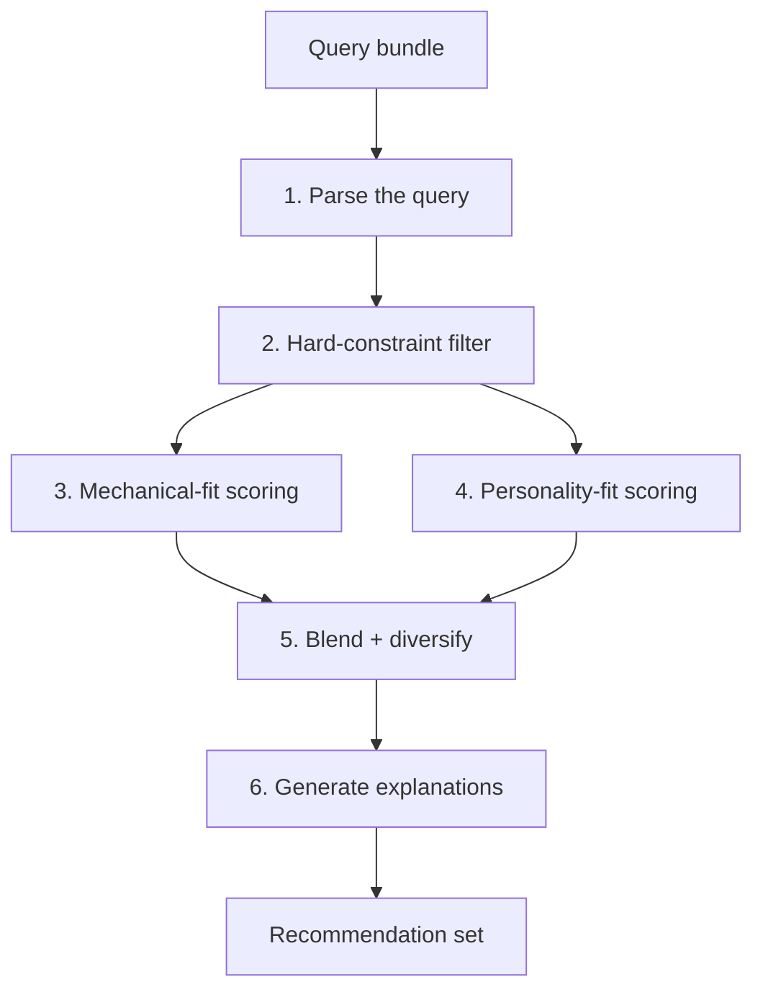
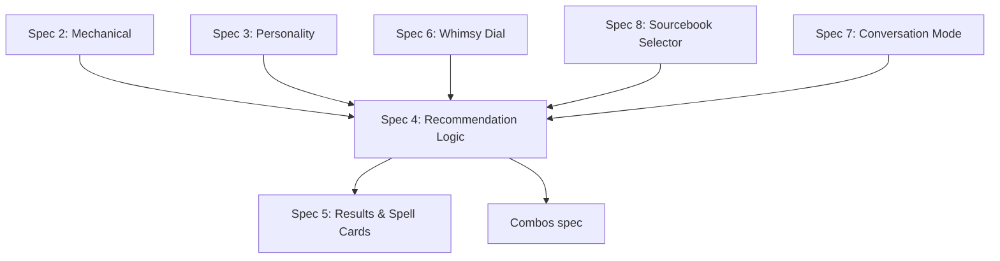

# Spec 4: Recommendation Logic

> See [spec.md](../spec.md) for the product overview. This spec covers the "Recommendation Logic" section of the master spec. It depends on [Spec 2](02-spell-data-mechanical.md) (mechanical data) and [Spec 3](03-spell-data-personality.md) (personality data).

---

## Overview

This is the engine. A user types something into the prompt box; this spec defines how that string becomes a ranked, diversified list of spell recommendations with written explanations.

It is not a spec about the prompt UI (Spec 1) or about how the results are rendered (Spec 5). It covers the middle: query in, recommendations out. Every decision about *which* spells to return and *why* lives here.

This spec also does not cover spell combos, the Whimsy Dial UI, or conversation-mode UX. It defines the *interface* those features plug into — the dial position is an input to this pipeline; conversation history is an input consumed by the parse step and owned by [Spec 7](07-conversation-mode.md) — but each of those features has its own spec.

---

## What This Spec Delivers

Given:

- A user query (free-form text).
- The configured Whimsy Dial position.
- The current set of enabled sourcebooks.
- An optional requested result count (default 5, max 10).

The system returns:

- A ranked list of spell recommendations.
- For each, a per-spell explanation ("why this spell") connecting the recommendation to the user's query.
- Optional system-level messaging for edge cases (impossible requests, rules questions, extremely open-ended queries).

---

## Inputs and Outputs

### Input: The Query Bundle

- **Query text** — the raw user input.
- **Whimsy dial position** — one of `tactical`, `balanced` (default), `creative`, `theatrical`, `chaotic`.
- **Enabled sourcebooks** — from the user's current settings (Spec for the sourcebook selector will define the UI; this spec treats it as a list of allowed sources).
- **Requested count** — integer, 1–10, default 5.
- **Conversation context** — prior queries and recommendations in the session. Consumed and owned by [Spec 7](07-conversation-mode.md); this spec defines the shape of the input (list of prior turns with prompt text, dial position at submit, and spell IDs returned) and how the parse step folds it into the current query.

### Output: The Recommendation Set

- **Ordered list of spells** — each entry contains the spell's identifier plus the per-spell explanation.
- **Set-level message** (optional) — used for edge cases: "no spell exactly matches, but here are the closest options," or direct answers to rules questions, or a note that the system is leaning into "surprise me" mode.
- **Reasoning trace** (internal, not user-visible) — a record of which query signals were extracted, which spells were filtered/scored, and why each final pick was chosen. This supports debugging and tuning without being part of the user interface.

---

## The Pipeline

Each step is defined below. Steps 3 and 4 run in parallel over the same filtered candidate pool.

---

### Step 1: Parse the Query

The query is interpreted into a structured signal set. This is an LLM-driven step — the query space is too open for a rule-based parser. The LLM returns a structured bundle containing:

- **Hard constraints** — mechanical limits the user has specified: spell-level caps, concentration/no-concentration, component restrictions, specific schools allowed or excluded, specific damage types required, casting-time constraints, ritual-only, etc. A missing constraint means "no preference," not "must not have."
- **Tactical goals** — what the user is trying to *accomplish* (escape, protect, deal damage to a group, disable a flying target, end a fight, buy time).
- **Situational context** — the scene being described (collapsing mine, king's banquet, bridge over a volcano, flooded dungeon). Used mostly for explanation writing and personality matching.
- **Stylistic signals** — tone, mood, and vibe words (dramatic, creepy, whimsical, subtle, grim, tender).
- **Character-identity signals** — archetype cues (necromancer villain moment, wizard who's also a chef, bookish scholar).
- **Query type classifier** — one of:
  - `recommendation` — normal request (the default).
  - `open-ended` — "surprise me," "what's the best spell," "throw something weird at me." Triggers a diversity-heavy and whimsy-heavy mode.
  - `impossible` — contradictory or unsatisfiable ("a 1st-level spell that deals 100 damage"). Triggers the "closest approximation" response.
  - `rules-question` — "can I use Counterspell on a trap?" Returns a short set-level answer only; no spell cards follow. See [Spec 7](07-conversation-mode.md#5-rules--meta-qa) for the transcript-side behaviour.

The parser is also responsible for handling **casual or metaphorical phrasing** — "something cold and creepy," "spells that feel like a library." The structured output distils these into the signals above; downstream steps do not re-interpret the original string.

### Step 2: Hard-Constraint Filtering

The candidate pool starts as **all wizard spells from enabled sourcebooks** and is reduced by the hard constraints extracted in Step 1.

Hard constraints are *narrowing filters only* — they never score. A spell is either in the pool or out of it.

If hard constraints reduce the pool below a safety threshold (e.g., fewer than 10 candidates), the system proceeds but flags this in the reasoning trace, so Step 5's diversification expectations relax gracefully.

If hard constraints reduce the pool to **zero** spells, the query is routed to the `impossible` path (see Edge Cases below).

### Step 3: Mechanical-Fit Scoring

Each surviving candidate is scored on how well its **mechanical** attributes (Spec 2) match the tactical goals and situational context.

Examples of mechanical fit:

- "Deal with a flying enemy" boosts spells with long range, single-target capability, and conditions that ground (Earthbind) or disable (Hold Monster).
- "Escape" boosts spells tagged `movement`, spells that create barriers or obscurement, spells with teleport or misty-step effects.
- "Swarm of enemies in a tight space" boosts `damage` + `area-of-effect` spells and `control` spells with AoE shapes.
- "Protect the party" boosts `defense` and `buff` spells.

The scoring function operates on tags and structured fields; it does not re-read rules text. It produces a `mechanical_score` in a normalized range (e.g., 0–100). The exact weighting formula is a tunable heuristic — the spec does not pin it down, because it will change as the system is tested against real queries.

### Step 4: Personality-Fit Scoring

In parallel, each surviving candidate is scored on how well its **personality** attributes (Spec 3) match the stylistic signals, character-identity signals, and situational context.

Examples of personality fit:

- "Dramatic entrance" boosts high dramatic-potential scores, `awe-inspiring` and `triumphant` emotional tones, `scene-setter` social flavour.
- "Creepy necromancer moment" boosts `necromancer` and `shadow-weaver` archetypes, `sinister` / `eerie` tones, `rot` sensory tags.
- "Spells that feel like a library" boosts `scholar` archetype, `quiet` / `intimate` sensory tags, `character-signature` social flavour.
- "Something that would make a bard jealous" boosts high dramatic-potential, `theatrical` / `whimsical` tones, `scene-setter` flavour.

Personality scoring is a mix of tag overlap and **semantic similarity between the query signals and the spell's personality blurb**. The blurb carries nuance the tag vocabulary can't fully capture, so it is a first-class input to this step — not a decoration.

Produces a `personality_score` in the same normalized range as mechanical_score.

### Step 5: Blend and Diversify

This is the step where opinions show up. Raw top-N by blended score produces boring, same-y, obvious results. Diversification is what makes the tool feel smart.

**Blend.** The two scores are combined into a single `blended_score` using weights determined by the Whimsy Dial (see Whimsy Dial Integration below). At `balanced`, the weights are roughly equal. At `tactical`, mechanical dominates. At `theatrical`, personality dominates.

**Diversify.** Rather than returning the top N, the system selects N picks under the following rules:

1. **At least one strong mechanical pick** — even if its personality score is mediocre.
2. **At least one strong personality pick** — even if its mechanical score is mediocre.
3. **At least one "whimsy pick"** — a spell that ranks outside the obvious top tier but is an unexpected, non-obvious fit for the query. The whimsy slot is where the product's joy lives.
4. **Spread across spell levels** when the query does not specify a level.
5. **Avoid redundancy** — do not return two spells that are too similar to each other (same school + same combat role + overlapping sensory signature + comparable level). The reasoning trace records which spells were skipped for similarity.
6. **Fill remaining slots** from the highest blended scores that don't violate the above rules.

When the candidate pool is small (flagged in Step 2), rules 1–3 may collapse — the system does its best with what is available and notes the relaxation in the set-level message if the user should be aware.

### Step 6: Generate Explanations

For each selected spell, an LLM writes a short "why this spell" explanation. The explanation draws on:

- The user's query text (quoted or paraphrased directly).
- The spell's mechanical data.
- The spell's personality blurb and tags.
- The reasoning trace for this specific pick (is this the mechanical pick? the personality pick? the whimsy pick?).
- The Whimsy Dial position (voice is warmer at `balanced`, drier at `tactical`, more theatrical at `theatrical`, more unhinged at `chaotic`).

Explanation requirements:

- **Reference the user's situation directly.** Never generic.
- **Explain both practical and stylistic reasoning** where both apply.
- **Voice is warm, slightly playful, like a knowledgeable friend.** Not a rulebook, not a hype machine.
- **Point out non-obvious uses or interactions** when relevant.
- **Be honest about limitations.** "This won't solve the flooding, but it'll buy you a round."
- **No rules errors.** Mechanical claims in the explanation must match Spec 2 data. A spell with range 120 feet is not described as "long-range" casually if 120 is mid-range; concrete mechanical claims are grounded.

The explanation for the whimsy-slot pick is encouraged to lean into the unexpected — "this probably isn't what you meant, but hear me out."

---

## Whimsy Dial Integration

The dial affects this pipeline at three points:

1. **Score blending (Step 5).** The mechanical-to-personality weight ratio shifts along the dial. `tactical` weights mechanical ~75 / personality ~25; `balanced` is roughly 50/50; `theatrical` is ~25/75; `creative` sits between balanced and theatrical; `chaotic` inverts the diversity rules so the whimsy slot expands to the majority of results.
2. **Diversity rules (Step 5).** At `chaotic`, the whimsy slot count increases and the similarity-avoidance rule loosens (chaos tolerates weirdness). At `tactical`, the whimsy slot may drop to zero and diversity rules tighten toward "best mechanical picks, period."
3. **Explanation voice (Step 6).** The voice shifts along the dial — drier and more direct at `tactical`, warmer and wittier at `balanced`, florid and theatrical at `theatrical`, borderline unhinged at `chaotic`.

The dial does **not** affect:

- The accuracy of any mechanical data presented.
- Hard-constraint filtering.
- Data quality in the reasoning trace.

---

## Edge Cases

### Impossible or Contradictory Queries

When Step 2 yields zero candidates, or when the parser classifies the query as `impossible`:

- The set-level message acknowledges the constraint and names the specific conflict (e.g., "no 1st-level spell deals 100 damage").
- The system relaxes the most restrictive constraint and produces a candidate pool from the relaxed version.
- Returned recommendations carry honest notes about how they miss the original ask ("Magic Missile is the closest 1st-level fit but maxes at 3d4+3 damage").

### Extremely Open-Ended Queries

"Surprise me," "what's the best spell," "throw me something weird":

- The parser tags the query `open-ended`.
- Hard-constraint filtering is trivial (no constraints).
- Scoring proceeds but is heavily biased toward the whimsy and cleverness axes.
- The set emphasizes diversity — spread across levels, schools, and archetypes.

### Rules Questions Disguised as Recommendations

"Can I use Counterspell on a trap?":

- The parser tags the query `rules-question`.
- The set-level message answers the question directly, drawing on spell data and general rules knowledge.
- **No spell cards follow.** Rules questions return the answer alone for MVP — simpler, fewer edge cases, cleaner transcript. Answer-plus-related-spells is tracked as a potential future enhancement.

### Level-Dependent Queries

"I'm a 7th-level wizard":

- Parser extracts a hard constraint: spell level ≤ 4 (standard 5e slot progression).
- The parser also surfaces a **slot-economy hint**: recommendations should avoid proposing multiple 4th-level spells in a single turn's worth of combat, because the character only has one or two 4th-level slots.
- The pipeline does not model specific character builds, subclasses, or class features. Slot economy is the only level-aware concession.

### Ambiguous or Empty Queries

- An empty query does nothing (the prompt UI blocks submission; this spec treats an empty query as invalid input and returns no result).
- A query so vague that the parser cannot extract any signal (e.g., random keystrokes) returns a set-level message asking the user to say more, with a few example-query nudges.

---

## Handling Multiple Spell Recommendations vs Combos

This spec produces **individual spell recommendations only**. When the query naturally invites a combo ("open the fight dramatically, then shut it down"), the pipeline may return spells that could combo together, but it does not structure its output as a combo (sequencing, slot cost, scene description).

Combo recommendations are covered by a separate later spec. The hook for them is in the reasoning trace: the parser may flag a query as `combo-friendly`, and the combo spec will consume that flag and produce a combo alongside individual picks.

---

## Relationship to Other Specs

Spec 4 is the central feature; several later specs extend or consume its output.

---

## Out of Scope for This Spec

- **Spell combos.** Covered by a separate later spec.
- **Conversation mode and follow-ups.** "What about something lower level?" / "Give me more like the third one" — owned by [Spec 7](07-conversation-mode.md). This spec preserves the hook (conversation context as an input) but does not define the UX or turn behaviour.
- **Whimsy Dial UI.** The dial is an input here; the control that sets it lives in a separate spec.
- **Sourcebook selector UI.** Same — the enabled-sourcebooks list is an input; the control lives elsewhere.
- **Results rendering.** How the recommendation set is displayed (cards, expansion, personality-tag labels, more-like-this buttons) is Spec 5.
- **Caching, rate limiting, cost controls, prompt-injection defences.** Operational concerns not addressed at this level.
- **Multi-class recommendations.** Wizard only, per Specs 2 and 3.

---

## Resolved Design Decisions

- **LLM-driven query parsing.** The query space is too open for a rule-based parser. A structured signal bundle is the parser's output contract; downstream steps operate on the bundle, not the raw string.
- **Parallel mechanical and personality scoring.** Both dimensions score every candidate; they combine in Step 5. Neither dimension is a gate for the other.
- **Hard constraints filter; they do not score.** A spell is in or out. Scoring happens on the survivors.
- **Diversity is explicit, not emergent.** Top-N-by-score is rejected. The system always reserves slots for mechanical pick, personality pick, and whimsy pick, and actively prevents near-duplicates.
- **The personality blurb is a first-class scoring input.** Semantic similarity against the blurb supplements tag overlap — the blurb is not just for human reading.
- **The reasoning trace is always produced.** Even when not user-visible, it is generated per-query for debugging and tuning. It is also what downstream specs (combos, conversation mode) can hook into.
- **Whimsy Dial is a pipeline-wide modifier.** It affects blending weights, diversity rules, and explanation voice. It never affects mechanical accuracy or hard filtering.
- **Explanations are LLM-generated per spell.** Not templated. Voice adapts to the dial.
- **Slot economy is the only level-aware concession.** The system does not model character builds, subclasses, or features beyond spell-slot availability at the user's stated level.

---

## Resolved: Implementation Details

- **Sensible scoring defaults, tuned later.** First-pass defaults: mechanical/personality blend is 75/25 at `tactical`, 60/40 at `creative`, 50/50 at `balanced`, 35/65 at `theatrical`, 20/80 at `chaotic`. Whimsy-slot count is 0/1/1/1/3 across the five dial positions (out of 5 results). Similarity threshold is a simple "same school + same primary combat role + same targeting + within one spell level = too similar." All of these are exposed as configuration, not hard-coded. Fine-tuning against real output is tracked as a deferred task in [spec.md](../spec.md#optional--deferred-features).
- **Two LLM calls per query.** One call parses the query into the structured signal bundle; a separate call generates the explanations after spells are selected. This keeps concerns cleanly separated, makes each prompt smaller and more debuggable, and lets parsing be cached by query text while explanation is cached per (spell, query, dial) tuple.
- **Soft check on rules claims in explanations.** Flag-and-log rather than regenerate-until-clean — latency matters, and occasional drift is acceptable. When the system writes an explanation that touches on a rules interaction where the spell's own text is ambiguous or where the situation isn't fully covered by the spell (e.g., unusual applications, edge-case timing), the explanation explicitly nudges the user to verify with their DM. This honesty builds trust and matches the "warm, knowledgeable friend" voice better than false confidence.
