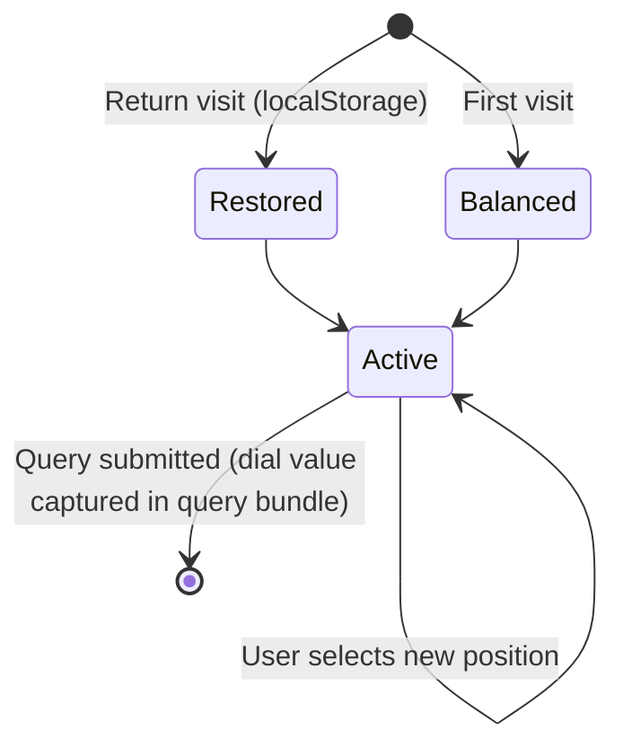

# Spec 6: Whimsy Dial

> See [spec.md](../spec.md) for the product overview, particularly "The Whimsy Dial" section. The dial is consumed as an input by [Spec 4](04-recommendation-logic.md) (recommendation logic); this spec covers only the control itself — how the user sees, sets, and perceives the dial.

---

## Design Artefacts

- **Canonical mock:** [`mockups/spec-06-canonical.html`](mockups/spec-06-canonical.html) — the locked visual direction for the whimsy dial. Interactive HTML that demonstrates the five-rune linear row at the base of the viewport, per-whimsy theme re-tinting of the surrounding canvas, and the ambient needle rotation inside the decorative casting circle. This is the reference of record; prose in this spec describes it, not the other way around.
- **Archived explorations:** See `mockups/archive/` for earlier directional studies (H, I, J, the K–Z series, and `spec-06-canonical-polar-arc.html` — the previous canonical that positioned the runes on a southern arc around the casting circle's rim). These are preserved for historical context but are no longer the canonical direction.

---

## Overview

The Whimsy Dial is the user's knob for tuning the *personality* of recommendations. Five positions along a spectrum from practical to unhinged. It is prominent, playful, and persistent — not a hidden setting buried behind a menu.

This spec covers the dial as a visible, interactive control on the page: where it lives in the layout, how it looks, how the user changes it, and how its state persists.

---

## The Five Positions

In order along the spectrum:

1. **Tactical** — practical, mechanical-first recommendations.
2. **Balanced** — the default; a mix of practical and thematic.
3. **Creative** — lateral, clever, non-obvious applications.
4. **Theatrical** — maximum drama and spectacle.
5. **Chaotic** — off-script, absurd-but-valid, majority-whimsy.

The positions are discrete, not continuous. There is no "between balanced and creative" setting — the dial snaps to one of the five.

---

## Placement and Layout

The dial is a **horizontal row of five rune symbols pinned to the base of the viewport, directly beneath the prompt dock** established in [Spec 1](01-prompt-box-and-landing.md). It is not a separate widget beside the prompt and it is not part of the header — it is the prompt's flavour control, wired into the prompt's own band.

Two elements compose the canvas Spec 6 operates on:

1. **The whimsy row** — the five rune symbols themselves, evenly spaced in a single row at `bottom: 28px` with a `gap` of `72px` between runes, centered horizontally. Each rune is a 52px hit target containing a 34px line-drawn glyph and an always-visible label beneath it. The row sits **under** the prompt dock (which lives at `bottom: 72px`, per Spec 7), so from bottom to top the viewport stack is: whimsy row, prompt dock, transcript / landing content, ghosted casting circle behind everything.
2. **The casting circle** — retained from Spec 1 as an atmospheric companion. It is not part of the control surface; it is ghosted decorative background, shared across the whole app. Its compass needle rotates as an ambient feedback cue when the dial changes, and its ring strokes, halo, and glow re-tint to the active whimsy's theme colour.

When the user selects a rune, the surrounding canvas re-tints to that rune's theme and the needle inside the casting circle swings to a small angle that *gestures* toward the selected rune's position in the row (tactical leans left, chaotic leans right). The needle is not a literal pointer — the runes are not on the circle's rim — it is a subtle echo of the selection.

- **Landing state.** The whimsy row is visible on first paint with the default (Balanced) rune active. The casting circle and needle are present behind the landing content at reduced opacity.
- **Results state.** The whimsy row remains pinned to the base of the viewport. The casting circle stays behind the transcript. Changing the dial in the results state does not re-run the previous query automatically — the user must submit again (see Behaviour below).

Exact dock geometry (scrap width, rotation, backdrop) is owned by Spec 7's Design Artefacts section and not restated here; what Spec 6 pins down is the whimsy row's own numbers (`bottom: 28px`, `gap: 72px`, five runes centered) and the relationship "row sits directly below the dock."

---

## Visual Direction

The dial is a **horizontal row of five arcane runes** at the base of the viewport, with an atmospheric **casting circle** floating behind the content as a ghosted companion. It is not a generic UI slider; it is a line-up of in-world glyphs, each standing for one of the five positions.

### Canonical Mockup

The canonical visual direction is captured in [`mockups/spec-06-canonical.html`](mockups/spec-06-canonical.html). The mock shows the live five-rune row pinned to the bottom of the viewport below the prompt dock, the decorative casting circle behind, and the ambient needle rotation + per-whimsy re-tinting that accompany every selection.

### The Five Runes

Arranged in a single horizontal row, **left to right**: Tactical → Balanced → Creative → Theatrical → Chaotic. The row uses a flexbox layout — `gap: 72px`, centered horizontally — pinned to `bottom: 28px`. Each rune sits in a 52px hit target containing a 34px line-drawn glyph (stroke weight 1.6, rounded caps and joins) with an always-visible uppercase label in a display serif beneath it.

Runes are *not* polar-positioned. They do not sit on the casting circle's rim; they are an independent bottom-of-viewport instrument that happens to share the canvas with the circle.

Each rune carries its own Spec 6 palette (see Per-Whimsy Theming below) regardless of which rune is active, so the row always reads as five distinct options rather than five shades of one colour. The active rune brightens its stroke, lifts its label into full opacity, and gains an outer glow.

### The Casting Circle (Atmospheric Companion)

The casting circle established in Spec 1 remains on-screen as **ghosted decorative background** — not part of the control surface. Its ring strokes, halo, glow, and the small glyphs around its rim all derive from the same palette the dial drives, so the two surfaces feel of a piece. The circle does not respond to pointer events.

Inside the circle, a long bidirectional **compass needle** rotates as an ambient feedback cue when the dial changes. Its angle gestures toward the selected rune's position in the row without claiming to be a literal pointer — the runes are not on the rim. The needle:

- **North half** (trailing): dark iron / charcoal, brass-edged, matte.
- **South half** (leading): filled with the active theme's bright accent colour, with a soft glow drop-shadow tuned to the same theme.
- **Brass hub** at the pivot: outer brass ring, inner brass-dark ring, black centre point.
- Swings between angles with a `cubic-bezier(.3, 1.4, .5, 1)` ease — a satisfying overshoot-and-settle that feels mechanical, not digital.

#### Needle Angle Mapping

The needle rests pointing due south (0°). CSS `rotate()` is clockwise, so positive degrees tilt the needle **left** and negative degrees tilt it **right**. Mapping from the linear dial (left to right):

| Rune       | Needle angle        |
|------------|---------------------|
| Tactical   | `+30°` (leans left) |
| Balanced   | `+15°`              |
| Creative   | `0°` (due south)    |
| Theatrical | `-15°`              |
| Chaotic    | `-30°` (leans right)|

This convention is mirrored in Spec 7's Design Artefacts section; both specs must stay in sync if the numbers ever move.

### Per-Whimsy Theming

When the user selects a symbol, the entire casting circle's accent colour, glow, and needle tip re-tint to that position's theme:

| Position    | Theme name     | Core accent | Role                                  |
|-------------|----------------|-------------|---------------------------------------|
| Tactical    | Steel blue     | `#9fc5e8`   | Cool, precise, disciplined            |
| Balanced    | Emerald        | `#9fe3b8`   | Neutral, steady, measured             |
| Creative    | Gold (default) | `#ffd57a`   | Warm, inventive, the "at-rest" colour |
| Theatrical  | Violet         | `#d8a8ee`   | Performative, mystic, spectacular     |
| Chaotic     | Ruby           | `#ff9aa0`   | Dangerous, unhinged, vivid            |

The re-tint is driven by a single `data-whimsy` attribute on the `<body>` element; all canvas-wide colour cues (casting circle ring strokes, rim glyphs, halo, needle tip and glow) derive from CSS custom properties that swap in ~0.4–0.6s. Per-rune colours on the dial itself are scoped via `.whimsy-symbol[data-theme="X"]`, so each rune keeps its own Spec 6 colour regardless of which one is active. The selected rune also receives an `active` class that brightens its glyph and elevates its label.

### Principles

- **Five clearly labelled positions**, visible at all times — no hover-to-discover.
- **Current position is unambiguous** — the active rune is brighter and glowing, its label is lit, and the whole surrounding canvas (including the casting circle behind) glows its colour.
- **Deliberate, satisfying interaction** — canvas re-tint + ambient needle swing on click.
- **Visual register is in-world arcane** — brass, rune glyphs, parchment, candlelit glow. Not flat modern UI.

---

## Behaviour

### Setting the Dial

- Clicking a rune (the glyph or its label) sets the dial to that position.
- A visual transition accompanies the change: the surrounding canvas re-tints to the new theme colour (~0.4–0.6s) — casting circle glow, ring strokes, rim glyphs, halo, needle tip — and the needle inside the casting circle swings to the new ambient angle (~0.8s with an overshoot-and-settle ease). The transitions overlap but the whole sequence feels deliberate, not slow.
- Keyboard users can tab through the five runes and change position with the arrow keys (left/right along the row). Each rune is individually focusable as a fallback.

### Persistence

- The user's dial position persists in `localStorage` (same mechanism as the theme preference in Spec 1) so it survives page reloads.
- On first visit, the dial defaults to **Balanced**.
- There is no per-query "remember this setting" separate from the persistent preference — the dial represents the user's current choice, full stop.

### Interaction with Recommendations

- Changing the dial **does not** automatically re-submit the current query. The user changes the dial, then re-submits if they want new results under the new setting.
- Submitting a query always uses the dial's current position.
- On the results page, the dial remains fully interactive. A small indicator (subtle, not obtrusive) may appear when the currently-displayed results were generated under a different dial position than the current one — a hint that re-submitting will produce different results. The indicator's exact form is a design decision for the canonical mockup.

### No Hover Tooltips for Position Meaning

Each position's name is labelled directly in the control. If the user hovers, no additional tooltip explains what "Chaotic" means — the label is the promise, and the word does most of the work. An optional subtle help affordance (a small illuminated `?` icon near the dial, maybe) can reveal a longer explanation of all five positions in a single panel. This is a nice-to-have; not required for MVP.

---

## Responsive Behaviour

The linear five-rune row is the canonical arrangement at every breakpoint. It scales by tightening, not by restructuring.

- **Desktop.** The row as designed in the canonical mockup — five runes in a flexbox row, `gap: 72px`, pinned to `bottom: 28px`, full-size 52px hit targets with 34px glyphs. The casting circle floats behind at its Spec 1 size.
- **Tablet.** Same row. The `gap` may tighten (~48–56px) to fit narrower viewports, but the row structure and rune size stay put. The casting circle scales down behind.
- **Mobile.** Still one horizontal row of five runes. The `gap` tightens further (~24–32px), rune hit targets may shrink toward ~44px, and labels may reduce in type size but are not dropped. The casting circle shrinks significantly so it does not crowd the transcript. Five clearly labelled positions in a single row is the requirement at every breakpoint.

---

## State Diagram

---

## Behaviour Summary

| Scenario | Behaviour |
|---|---|
| First visit | Dial is at Balanced |
| Return visit | Dial is at whatever the user last set |
| User clicks a position | Dial animates to that position; preference persists |
| User submits query | Current dial position is sent as part of the query bundle |
| User changes dial after submitting | Results do not re-fetch; user must re-submit |
| User navigates away and returns | Dial remembers its last position |
| Theme toggled | Dial re-themes to match (light/dark wood palette) but its position is unchanged |

---

## Accessibility

Inherits the [master spec's Accessibility Baseline](../spec.md#accessibility-baseline). Dial-specific refinements:

- The dial is an ARIA `radiogroup` with an accessible name ("Whimsy"). Each rune is a `role="radio"` with `aria-checked` reflecting the active position and an accessible name matching its visible label ("Tactical", "Balanced", "Creative", "Theatrical", "Chaotic").
- Keyboard interaction follows the standard radiogroup pattern: tab into the group lands on the currently-selected rune; left/right arrows move selection and immediately update the dial (matching the on-click behaviour). Home/End jump to the first / last rune.
- The rune-swing, casting-circle re-tint, and needle rotation all collapse to an instant state change under `prefers-reduced-motion`. No timing or easing survives; the new theme is simply on.
- The casting circle and its needle are `aria-hidden="true"` per the baseline — the dial's `aria-checked` state is the single source of truth for "which whimsy is active".
- If a stale-dial indicator ships, it is an accessible name on the affected turn (owned by Spec 7), not an unlabeled visual.

---

## Out of Scope for This Spec

- **How the dial affects recommendations.** Covered by [Spec 4](04-recommendation-logic.md). The dial's *effect* is defined there; this spec only defines the *control*.
- **Custom / user-defined positions.** Five fixed positions. No user-created positions, no sliders between them.
- **Per-query dial overrides.** The dial is a persistent preference, not a per-query input toggle. One place to set it.
- **A help / tour explaining the dial.** An onboarding tour is not part of this spec.
- **Sharing a dial setting with other users.** Not a feature. The dial is per-browser.

---

## Resolved Design Decisions

- **Canonical visual direction:** Linear row of five runes at the base of the viewport, with the Spec 1 casting circle as an atmospheric companion behind. See `mockups/spec-06-canonical.html`.
- **Five discrete positions.** No continuous slider. Snap-to.
- **Dial lives below the dock, not on the circle.** The dial is a horizontal row pinned at `bottom: 28px` (`gap: 72px`, centered), sitting directly beneath the prompt dock. The casting circle is retained as ghosted decorative background; its compass needle echoes the active whimsy but is not a literal pointer at the runes.
- **Left-to-right order.** Tactical → Balanced → Creative → Theatrical → Chaotic. No polar arc.
- **Ambient needle angles.** Needle rotation mirrors the row position: tactical `+30°`, balanced `+15°`, creative `0°`, theatrical `−15°`, chaotic `−30°`. CSS `rotate()` is clockwise, so positive leans left. This convention is shared with Spec 7.
- **Per-whimsy re-tinting.** The surrounding canvas — casting circle glow, ring strokes, rim glyphs, needle tip — swaps to the selected position's theme colour (steel blue / emerald / gold / violet / ruby). The cascade is driven by `data-whimsy` on `<body>`. Per-rune palettes on the dial itself are independent, so each rune always shows its own colour.
- **Persists in localStorage.** Survives reload; defaults to Balanced on first visit.
- **Changing the dial does not auto-resubmit.** User submits when ready.
- **Labels are always visible.** No hover-to-reveal names.
- **Visually in-world.** Brass, rune glyphs, candlelit glow, parchment — not generic UI.
- **Linear row at every breakpoint.** Mobile tightens spacing and shrinks runes; it does not restructure. Five labelled positions in a single row is the requirement.
- **No stale-dial indicator on the landing/results page.** [Spec 7](07-conversation-mode.md) adds a stale-dial hint in conversation context where it's actually useful (a per-turn cue when the dial has moved since an earlier turn). Spec 6's control surface itself does not flag staleness.
- **Help affordance is deferred.** An optional `?` panel describing the five positions is tracked as an optional/deferred feature in the [master spec](../spec.md#optional--deferred-features), not built for MVP. The labels do the work.
