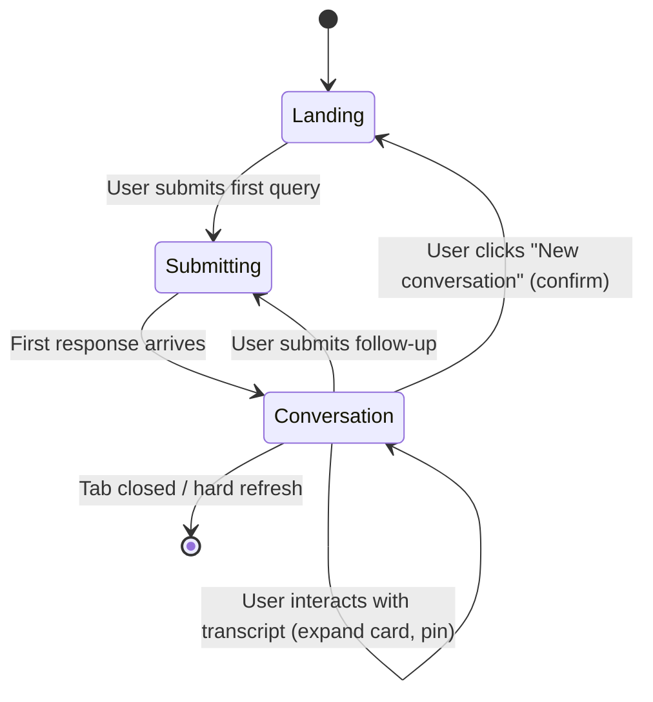

# Spec 7: Conversation Mode

> See [spec.md](../spec.md) for the product overview, particularly the "Conversation Mode" section. This spec builds on [Spec 1](01-prompt-box-and-landing.md) (prompt box), [Spec 4](04-recommendation-logic.md) (recommendation pipeline), [Spec 5](05-results-and-spell-cards.md) (results rendering), and [Spec 6](06-whimsy-dial.md) (the dial).

---

## Design Artefacts

- **Canonical mock:** `mockups/spec-07-canonical.html`.
- **Scope note:** This spec defines behaviour and architecture; the canonical mock and the component sheets under `mockups/components/` own the visual surface. When prose and mock disagree on a visual detail, the mock wins.

---

## Overview

After the first query, the product becomes a conversation. The user follows up, amends the scene, refines constraints, or riffs on a specific recommendation, and the system responds in context — like brainstorming with a clever, well-read wizard friend rather than running discrete searches.

This spec covers turn structure, context retention, the kinds of follow-ups supported, how the dial interacts with a live conversation, and the data shape that flows between client and server to make it work.

---

## Turn Model

The results surface is a **scrolling transcript**. Each turn is a unit of:

1. **The user's prompt** — what they typed.
2. **The dial position at submit time** — captured with the prompt.
3. **The recommendation set** — the cards the system returned, plus any set-level message.

Turns stack vertically in the order they were submitted. The oldest turn is at the top; the newest at the bottom. Per [Spec 5](05-results-and-spell-cards.md#transition-from-landing), the landing chrome — dock, dial, and casting circle — persists after the first submit; the prompt scrap stays docked and the transcript builds between it and the chrome. The dock is always reachable; the user never has to scroll to find it.

Turns are **immutable once committed**. A turn's dial value, prompt text, and recommendations do not change retroactively. If the user changes the dial and re-submits, that becomes a new turn.

---

## Context Retention

Conversation context is **session-scoped and in-memory**:

- Lives for the lifetime of the tab.
- Closing the tab, hard-refreshing, or navigating away ends the conversation.
- No `localStorage` persistence, no server-side thread storage. (Server-side persistent conversations are deferred until user accounts exist — see [Out of Scope](#out-of-scope-for-this-spec).)
- A "New conversation" affordance in the header (or adjacent to the prompt) clears the transcript and starts fresh. Required because the natural "start over" gesture — closing the tab — is hostile on a long-running session.

The client keeps the canonical conversation state. Each submission sends the full conversation context to the server; the server is stateless with respect to conversations.

---

## Round Limit and Rate Limiting

Arcane Advisor is a recommendation tool with a short exploratory tail — not a chat app. Conversations are capped at a fixed number of **rounds** (turns) per session. This serves three purposes:

1. **Keeps the product on-mission.** It nudges the user to frame good initial queries and explore a handful of follow-ups, rather than treating the system as an extended chat partner.
2. **Bounds LLM cost and context size.** Every round is a full pipeline run; a hard cap puts a ceiling on both spend per session and the prompt size shipped to the model.
3. **Serves as a natural rate-limit.** Anonymous, account-less users cannot drive unlimited traffic by automating follow-ups on a single tab.

### The cap

- The default cap is **5 rounds per conversation** (1 initial query + 4 follow-ups). This number is a first-pass guess and is expected to be tuned once real usage data is available.
- The cap is enforced **server-side**, not just client-side. The client disables the prompt when the cap is reached; the server rejects over-cap submissions regardless.
- The cap is per-conversation, not per-day. Starting a new conversation resets it.

### What counts as a round

**Every prompt the user submits counts as one round.** There are no free rounds. This includes:

- Initial queries and follow-up refinements
- Rules/meta Q&A (e.g., *"What does concentration mean?"*)
- Amendments, card-anchored expansions ("More like this"), and permutation requests
- Prompts that produce set-level fallback messages (e.g., "no exact match — here's what comes closest")

Treating every kind of submission uniformly keeps the cap legible and preserves its rate-limiting function. If rules questions were free, a user could drive unbounded traffic by phrasing every prompt as a rules question.

**The one exception: errors do not consume a round.** If the server fails to return a usable response (timeout, upstream failure, validation error that isn't the user's fault), the round counter is not incremented and the user is invited to retry or edit the query. Errors caused by malformed user input (e.g., empty prompt) do not count either — nothing was really submitted.

A round is spent the moment the server commits a response — success, partial, or fallback — back to the transcript.

### Approaching and reaching the cap

- **Rounds remaining is surfaced quietly.** A small counter near the prompt (e.g., "3 of 5") lets the user see how many rounds they have left. Muted until the final round, at which point it becomes a little more prominent.
- **On the final round**, the UI shows a gentle cue ("last round — make it count"), placed so it doesn't feel punitive.
- **When the cap is reached**, the prompt disables. The transcript remains fully interactive — users can still expand cards, click "More like this" (which becomes a no-op with a tooltip), and read prior turns. The only blocked action is submitting another follow-up.
- **The user can always start a new conversation.** The "New conversation" affordance is the release valve — clicking it clears the transcript and resets the round counter. Confirmation step applies as before.

### Additional rate-limiting

The round cap is the primary throttle per conversation, but basic per-IP rate limiting (new-conversation starts per minute/hour) belongs at the infrastructure layer to prevent abuse by users who simply start a new conversation after each cap. That is handled outside this spec.

---

## Supported Follow-Up Types

The first version handles four kinds of follow-up, all detected by the query-parse step (see [Spec 4 Step 1](04-recommendation-logic.md#step-1-parse-the-query)). The user does not classify their follow-up — they type naturally, and the system figures out what they meant.

### 1. Refine the same query

The user tightens or loosens constraints against the same situation.

> *"What about something lower level?"*
> *"Any of those work without verbal components?"*
> *"Show me only concentration-free options."*

Behaviour: the system re-runs the pipeline against the same situational context (tactical goals, scene, stylistic cues from prior turns), but with the new or revised constraints layered on.

### 2. Amend the situation

The user adds new facts to the scene itself. The scenario is evolving.

> *"Actually, the mine is also flooded."*
> *"The troll we're fighting has two friends now."*
> *"We're out of spell slots above 2nd."*

Behaviour: the new facts are merged into the situational context. Prior constraints carry forward unless explicitly superseded. The system treats the combined scene as the new ground truth for subsequent turns.

### 3. Expand a specific card

The user pins a prior recommendation and asks for more like it, or a variation on it.

> *"More like the third one."*
> *"Give me a weirder version of Fireball."*
> *"What's a more dramatic take on Silvery Barbs?"*

This also covers the per-card **"More like this"** and **"Surprise me"** buttons defined in the master spec — pressing either synthesizes a follow-up prompt referencing that specific spell and submits it as a new turn.

Behaviour: the pinned spell becomes a positive reference point for scoring. "Surprise me" adds pressure to prefer *distant* matches along the personality axes; "More like this" adds pressure to prefer *near* matches. The pipeline explanation refers back to the pinned card by name.

### 4. Explore permutations of one or more recommendations

The user asks for variations across the current result set or a subset of it.

> *"Something between the first and fourth one."*
> *"Are there versions of these that aren't all evocation?"*
> *"What if I wanted these but creepier?"*

Behaviour: the referenced cards form a reference bundle; the pipeline scores new candidates against that bundle and applies the stylistic modifier from the query. The explanation references the source cards.

### 5. Rules / meta Q&A

The user asks a rules question rather than requesting a recommendation.

> *"What does concentration mean?"*
> *"Does being prone affect concentration saves?"*
> *"How many reactions do I get per round?"*

Behaviour: the query-type classifier routes these to a short-form rules answer. The response is rendered as a **set-level message** in the transcript (same visual treatment as a "no exact match" message) — a short italic banner summarizing the answer, with a citation to the relevant rule. No spell cards follow. The answer is concise by design; this is not a full rules-lookup conversational agent.

Rules Q&A consumes a round like any other submission (see [What counts as a round](#what-counts-as-a-round)).

---

## Whimsy Dial Behaviour in a Conversation

The dial is **"now" only**:

- Each turn captures the dial value at submit time. The value is stored with that turn and displayed alongside it in the transcript (a small coloured mark or rune matching the turn's whimsy theme).
- Changing the dial mid-conversation re-themes the live casting circle immediately (per [Spec 6](06-whimsy-dial.md)) but **does not** re-tint prior turns. History is immutable.
- The next submitted turn uses whatever the dial is set to at that moment.
- A subtle hint surfaces if the dial has moved since the last turn — a quiet indicator next to the prompt scrap that says "Whimsy changed — next recommendations will swing [colour]." This is the stale-dial cue deferred from Spec 6; in a conversation context it is actually useful.

---

## Data Flow

### Query bundle (per turn)

Each submission sends to the server:

- **Query text** — what the user just typed.
- **Whimsy dial position** — current value at submit.
- **Enabled sourcebooks** — from user settings.
- **Requested count** — default 5, max 10.
- **Conversation history** — an ordered list of prior turns, each containing:
  - the prior prompt text
  - the prior dial position
  - the spell IDs returned (not the full card data — the server can rehydrate from IDs)
  - optional pinned/referenced card IDs (for Types 3 and 4 above)

The server is stateless. The client is the source of truth for the conversation.

### Server response (per turn)

- The recommendation set for this turn (same shape as Spec 4 output).
- An optional **interpreted intent** marker: which of the four follow-up types the parse step identified. The client can use this to style the turn appropriately (e.g., a "refining" turn might visually connect to the prior turn with a thin line; an "amending" turn might add a small edit-glyph next to the prompt).
- A **conversation-understanding trace** (internal) — which prior turns and which cards were considered in scope, and which were ignored. Supports debugging and tuning, not user-visible.

### Context window management

Conversation history is bounded by the round cap (see [Round Limit](#round-limit-and-rate-limiting)), which means the full transcript always fits in the LLM context budget with room to spare. The server sends every prior turn verbatim to the parse step — no summarization, no rolling scene state, no truncation. Simple and exact.

---

## UI Behaviour

### Transcript rendering

Each turn in the transcript shows:

- The user's prompt text, rendered in the same italic hand-inked style as the live prompt scrap (but smaller, and in a muted ink tone to distinguish history from the active input).
- A small whimsy badge indicating the dial position that turn was submitted under.
- The recommendation cards (Spec 5 defines card appearance). In-transcript cards retain full interactivity — expandable description, "More like this," "Surprise me."
- A thin separator between turns.

### Active prompt

The live prompt scrap stays pinned. It is always visible and always reachable via the `/` keyboard shortcut (defined in Spec 1). Submission appends a new turn to the transcript and scrolls it into view.

### Loading state

While a follow-up is in flight:

- The prompt disables (same treatment as Spec 1's loading state).
- A skeleton turn appears at the bottom of the transcript with placeholder card skeletons — the transcript grows before the response arrives, which keeps the layout calm.
- The casting circle's halo pulses slightly more actively during the wait, reinforcing that something is happening.

### "New conversation"

A small affordance (likely a subtle sigil or label near the header or the prompt, exact placement TBD in the mock) clears the transcript after a confirm step. On first click it shows "Start fresh?" with a quiet accept/cancel. No destructive action on single click — the transcript is the user's thinking.

---

## Accessibility

Inherits the [master spec's Accessibility Baseline](../spec.md#accessibility-baseline) (WCAG 2.1 AA, keyboard-complete, blanket reduced-motion, decorative casting circle, focus stays on the dock after submit). The notes below are transcript-specific refinements.

- Each turn is a `<section>` with an `aria-label` summarizing its prompt (e.g., "Turn 2: 'What about lower level?'") so screen reader users can navigate turns by landmark.
- The transcript is a live region at polite priority — new turns are announced when they arrive. The announcement is a short form of the turn header ("Turn 3 — results received"), per the baseline; the cards themselves are not read aloud automatically.
- After submission, focus stays in the prompt dock textarea (which clears). Users who want to read into the transcript tab forward into the newly-rendered turn `<section>`; shift-tab from the dock walks backward into the most recent turn's cards.
- The whimsy badge on each turn has an `aria-label` stating the position (e.g., "Submitted under Creative whimsy").

---

## Responsive Behaviour

- **Desktop.** Transcript is vertically centred in the column below the casting circle, with comfortable margins. Cards render in the same grid Spec 5 defines.
- **Tablet.** Same layout with reduced side margins; transcript width matches the prompt scrap's natural width range.
- **Mobile.** Transcript is full-width. Cards stack. The casting circle shrinks significantly (per Spec 1 and Spec 6 responsive rules) so the transcript has room to breathe.

---

## State Diagram

---

## Behaviour Summary

| Scenario | Behaviour |
|---|---|
| First query submitted | Transitions from Landing to Conversation; first turn rendered |
| Follow-up submitted | New turn appended; transcript scrolls to it |
| User changes dial mid-conversation | Next turn will use new value; prior turns unchanged; stale-dial hint appears |
| User clicks "More like this" on a card | Synthesizes an "expand" follow-up referencing that card; submits as new turn |
| User clicks "Surprise me" on a card | Synthesizes a divergent-expand follow-up referencing that card |
| User clicks "New conversation" | Confirm step → transcript clears, round counter resets, return to Landing state |
| Tab closed or hard refresh | Conversation ends; no persistence |
| User approaches the round cap | Rounds-remaining counter becomes more prominent on the final round |
| User reaches the round cap | Prompt disables; transcript stays interactive; "New conversation" is the release valve |
| Client-side attempt to bypass the cap | Server rejects the submission; cap is authoritative server-side |
| Rules/meta question asked | System returns a short set-level answer (same format as "no exact match"); counts as a round |
| Server returns an error | Round is NOT consumed; user can retry or edit the query |

---

## Out of Scope for This Spec

- **Server-side conversation storage.** Conversations are session-only and in-memory client-side. Persistent threads (ChatGPT-style thread list, cross-device resume) require user accounts and are deferred.
- **Multi-conversation UI.** There is one active conversation at a time. No thread list, no named conversations, no "save for later."
- **Sharing a conversation.** No share URLs, no export. Deferred.
- **Full rules Q&A conversational agent.** Rules questions return a minimal polite answer; a full conversational rules assistant is a future feature.
- **Editing a prior turn's prompt.** Turns are immutable. To revise, submit a new follow-up.
- **Deleting a prior turn.** Same reason — history is part of context.
- **Branching / "what if" forks of a conversation.** One linear thread per session.

---

## Resolved Design Decisions

- **Scrolling transcript.** Each turn stacks vertically; full history visible. Not a replace-previous model.
- **Session-only persistence.** Client-held, in-memory. Closing the tab ends the conversation.
- **Five follow-up types for v1:** refine, amend, expand-card, permute-recommendations, rules Q&A. Rules Q&A returns a short set-level answer (no cards) but still consumes a round.
- **Every submitted round counts; errors do not.** Any user prompt that produces a server response — success, fallback, or rules answer — consumes a round. Only errors (timeout, upstream failure) refund the round.
- **Dial is "now" only.** Each turn captures dial at submit; prior turns are not retro-tinted.
- **Stale-dial hint appears in conversation context.** The deferred Spec 6 indicator becomes a useful cue here.
- **Stateless server.** Client sends full conversation history with each submission. Server rehydrates card data from IDs.
- **Conversations are round-capped.** Default 5 rounds (1 initial + 4 follow-ups). Cap is enforced server-side; it keeps the product on-mission, bounds LLM cost, and doubles as a rate-limit for account-less users.
- **No history summarization.** The cap makes full-transcript context small enough that every prior turn ships verbatim to the parse step. No rolling scene state.
- **"New conversation" requires confirmation.** Destructive; guard with a quiet accept/cancel. Also the release valve when the round cap is reached.
- **Turns are immutable.** No editing, no deleting, no branching.

---

## Design Artefacts

The visual language for Spec 7 is locked in two places: a single canonical flow that demonstrates every component in context, and a set of component sheets that isolate each piece for reference when building.

### Canonical flow

- [`mockups/spec-07-canonical.html`](mockups/spec-07-canonical.html) — the unified five-round consultation. One flow exercises every surface the spec calls for:
  - **Round 1 · Tactical** — standard spell request → set-header + three full spell cards (one expandable, one with a concentration badge).
  - **Round 2 · Balanced** — rules question → `set-message` answer (left-bar italic banner with PHB citation in the eyebrow).
  - **Round 3 · Creative** — over-constrained request → `set-message` "No exact match" preface + two cards with `card-match-badge` chips ("Closest fit", "Different damage type").
  - **Round 4 · Theatrical** — error → retry. Red error card with torn bottom edge and quoted prompt, followed by a shimmering skeleton turn showing the retry in flight.
  - **Round 5 · Chaotic** — final round → a `pinned-from` card ("Inspired by your mention of silence") alongside an expanded card showing the full-description section.
  - **Terminal state** — 5/5 sealed pips, whimsy dial replaced by the pulsing "Begin new consultation" beckon button, dock-scrap grayscale-sealed and disabled.
- A **Dock Preview** harness (top-left) flips the bottom-of-screen between Normal, Final Round, and Cap Reached so reviewers can see all three dock states without leaving the page.

### Component sheets

Each sheet isolates one component and shows every state it can be in (default, edge cases, palette sweep across all five whimsies where relevant, cap-reached variants). All sheets follow the same skeleton: breadcrumb back to the index, title, sub-description, then a series of named `state` sections each with a short italic note explaining what's being shown.

- [`mockups/components/index.html`](mockups/components/index.html) — the directory. Hero link to the canonical, then eight component cards grouped into Response surfaces and Chrome & chrome-adjacent.

**Response surfaces**
- [`spell-card.html`](mockups/components/spell-card.html) — the full-format parchment card used for every spell recommendation. Six states: Default, With Concentration, Anchored "Inspired by", Not an Exact Match, Expanded, Themed Palette Sweep.
- [`set-message.html`](mockups/components/set-message.html) — the narrative banner used for rules answers, "no exact match" prefaces, and "no results at all" dead-ends. Four variants plus a palette sweep.
- [`error-card.html`](mockups/components/error-card.html) — the red failure surface with torn bottom edge. Three states: Timeout (retryable), Upstream unavailable, Validation rejected.

**Chrome & chrome-adjacent**
- [`prompt-dock.html`](mockups/components/prompt-dock.html) — the torn-scrap textarea. Four states: Empty, Drafting (multi-line), Sealed (cap reached), Narrow viewport.
- [`whimsy-dial.html`](mockups/components/whimsy-dial.html) — the linear row of five runes. Six states: each rune active in turn, plus the cap-reached substitution where the dial is replaced by the beckon button.
- [`casting-circle.html`](mockups/components/casting-circle.html) — the ghosted ornamental circle and compass needle. Six tiles in a 2-column grid showing each whimsy's theming and needle rotation plus the neutral default.
- [`round-counter.html`](mockups/components/round-counter.html) — the top-right pip tally. Six fill states (Round 1/5 through sealed 5/5) plus a palette sweep at 3/5.
- [`transcript-turns.html`](mockups/components/transcript-turns.html) — the two halves of every round: user prompt scrap at three content lengths, whimsy-badge across all five palettes, the assistant set-header eyebrow, and the round-header / turn-divider separators.

### Conventions locked by these artefacts

- **Whimsy palette cascade.** A `data-whimsy="X"` attribute on `body` (canonical) or on a wrapper (component sheets) flips `--arcane`, `--arcane-deep`, `--arcane-glow`, `--needle-bright`, and `--needle-inner`. Per-symbol colours on the dial are scoped via `.whimsy-symbol[data-theme="X"]` so every rune keeps its own Spec 6 colour regardless of which one is active. Per-turn colours use `[data-turn-whimsy="X"]` on the turn wrapper and expose `--turn-arc` / `--turn-deep` for the meta badge.
- **Dial layout.** Five symbols in a flexbox row at `bottom: 28px`, `gap: 72px`, centered. Not a polar arc.
- **Needle rotation convention.** Needle rests pointing due south (0°). CSS `rotate()` is clockwise, so positive degrees tilt the needle **left** and negative degrees tilt it **right**. Mapping from the linear dial (left to right): tactical +30°, balanced +15°, creative 0°, theatrical −15°, chaotic −30°. The canonical's `rotationForAngle(angle) = -(angle − 180)` helper encodes this.
- **Dock geometry.** Prompt scrap at `bottom: 72px`, `width: 760px`, torn via a fixed `clip-path` polygon, rotated −0.8°. Textarea locked to 48px (two lines). Backdrop extends to viewport bottom (`height: 300px`) to prevent scrolled content bleeding through the prompt/symbol band.
- **Cap-reached terminal state.** Pips all lit, rounds label flips to "5 of 5 · Sealed" with dimmer colour, dock-scrap grayscales and disables, whimsy dial hides, cap-complete panel surfaces the pulsing "Begin new consultation" button. No accompanying headline or sub-text — the button alone.
- **Skeleton loading.** `.skeleton-card` with dashed border, shimmer animation, and a pulsing italic note ("Consulting the spellbooks…" / "Retrying — consulting the spellbooks…").
- **Background.** Fixed viewport-anchored radial gradient (`background-attachment: fixed`) so scrolling doesn't cross the ellipse boundary.

Any future UI change to Spec 7 should land first in the canonical and the affected component sheet, then be referenced from this section.
