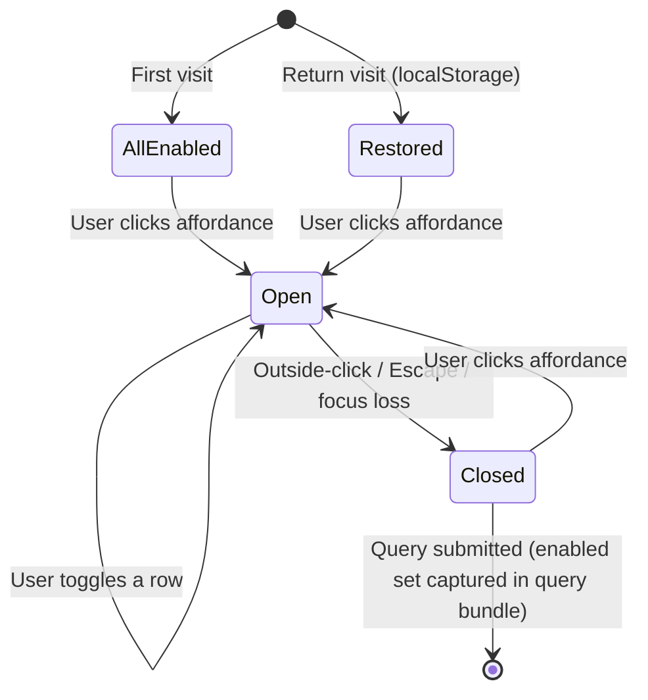

# Spec 8: Sourcebook Selector

> See [spec.md](../spec.md) for the product overview. The selector's output is consumed as an input by [Spec 4](04-recommendation-logic.md) (recommendation logic, "enabled sourcebooks" field of the query bundle) and referenced by [Spec 2](02-spell-data-mechanical.md) (spell data sources). This spec covers the control itself — how the user sees, sets, and perceives which sourcebooks are active.

> **Design artefacts.** The canonical mock is [`mockups/spec-08-canonical.html`](mockups/spec-08-canonical.html), which introduces the selector against the Spec 7 canonical flow. State-level rendering lives in [`mockups/components/sourcebook-selector.html`](mockups/components/sourcebook-selector.html) (collapsed variants, hover/open affordance, expanded panel, refuse-last-toggle).
>
> Prose led mocks here: this spec was written before the mocks. Where prose and mock disagree, the prose is the reference until the mock is explicitly reconciled.

---

## Overview

Arcane Advisor draws wizard spells from five official D&D 5e sourcebooks. Most users will want everything on, all the time. A smaller group — DMs running a PHB-only table, players whose group has ruled out a specific expansion — need to turn books off.

The Sourcebook Selector is the control that lets them do it. It is a persistent, lightweight setting, not a per-query input.

---

## The Five Sourcebooks

Canonical three-letter codes (established in the [master spec](../spec.md)):

| Code | Title                                  |
|------|----------------------------------------|
| PHB  | Player's Handbook                      |
| XGE  | Xanathar's Guide to Everything         |
| TCE  | Tasha's Cauldron of Everything         |
| FTD  | Fizban's Treasury of Dragons           |
| SCC  | Strixhaven: A Curriculum of Chaos      |

The codes are the identifier used everywhere downstream — in spell data, in reasoning traces, on spell cards.

---

## Placement and Visual Direction

The selector lives in the **app header** as a compact, always-visible control. It is not buried in a settings panel and it is not a modal — the user can see at a glance which books are active and toggle them without leaving the page.

### Collapsed Form

A single affordance in the header, to the right of the logo (exact position shared with the theme toggle; see Spec 1). It consists of:

- A small **stacked-tomes icon** (line-drawn, matching the in-world arcane register).
- A **count** beside the icon: "5 books" when all are enabled, "3 of 5" when some are disabled, "1 book" when only one is on.

The control reads at a glance: icon says "sourcebooks," count says "how many are on." The count is the truth — no colour states, no "modified" badges.

### Expanded Form

Clicking the control opens a **dropdown panel** anchored to the affordance. The panel contains:

- A short header line: "Sourcebooks".
- Five rows, one per book, in the canonical order (PHB → XGE → TCE → FTD → SCC).
- Each row shows: the three-letter code (display serif, prominent), the full title (smaller, secondary weight), and a checkbox-style toggle on the right.
- A small footnote at the bottom: "At least one book must be enabled."

Rows are clickable across their full width — hitting the row toggles its checkbox. The panel closes on outside-click, Escape, or when focus leaves.

The dropdown is in-world in register (parchment backdrop, serif type, candlelit accent) but quieter than the dial and the casting circle — this is a utility surface, not a feature surface.

---

## Behaviour

### Default State

On first visit, **all five sourcebooks are enabled**. The product's range is visible from the first query.

### Toggling

- Clicking a row toggles that book on or off.
- The change takes effect immediately for any *subsequent* query. It does **not** re-run the current query (consistent with the Whimsy Dial behaviour in [Spec 6](06-whimsy-dial.md)).
- The collapsed-form count updates as the user toggles.

### Minimum Selection

At least one sourcebook must remain enabled. If the user tries to uncheck the last remaining book, the toggle ignores the click and the footnote briefly emphasises ("At least one book must be enabled"). No modal, no error — the control just refuses the operation.

This guarantees the recommendation pipeline in Spec 4 always has a non-empty candidate pool.

### Persistence

The user's selection persists in `localStorage` (same mechanism as the Whimsy Dial in Spec 6 and the theme preference in Spec 1) so it survives page reloads. The storage key is scoped to the app and contains an array of enabled three-letter codes.

On return visits, the stored selection is restored before the first paint of the header, so the count is correct from the moment the control is visible.

If the stored value is malformed or empty (edge case: corrupted localStorage, or a future version that added a new book), the system falls back to "all five enabled."

### Interaction with Recommendations

- The full set of enabled codes is passed as the `enabled_sourcebooks` field of the Spec 4 query bundle.
- Changing the selector does not auto-resubmit. The user submits when ready.
- No stale-selection indicator on the results page for MVP. If this proves confusing, revisit — but the dial already established the "user knows what they changed" default.

---

## Relationship to Spell Cards

Individual spell cards in the results surface display their sourcebook code (small, three-letter). The canonical placement — in the card's meta line, `Lvl 2 · Conjuration · PHB` — and exact styling are owned by [Spec 5](05-results-and-spell-cards.md#sourcebook-code-placement); Spec 8 only commits to the fact that the code *is* surfaced per-card.

This attribution is useful for two reasons: a user who has disabled books still sees where their results came from in mixed settings, and a user considering disabling a book can see what they'd lose by flipping through typical results.

---

## Responsive Behaviour

- **Desktop and tablet.** The control sits in the header as described. The dropdown panel anchors to the affordance, ~280px wide.
- **Mobile.** The icon + count remains in the header. The dropdown may expand to fill more of the viewport width for comfortable tap targets, but the five-row structure is unchanged.

---

## State Diagram

---

## Behaviour Summary

| Scenario | Behaviour |
|---|---|
| First visit | All five books enabled |
| Return visit | Selection restored from localStorage |
| User toggles a book | Collapsed count updates; persists immediately |
| User tries to disable the last book | Toggle refuses; footnote emphasises |
| User submits query | Enabled set sent as part of the query bundle |
| User changes selection after submitting | Results do not re-fetch; user must re-submit |
| localStorage corrupted / missing | Falls back to all five enabled |

---

## Accessibility

Inherits the [master spec's Accessibility Baseline](../spec.md#accessibility-baseline). Selector-specific refinements:

- The collapsed affordance is a real `<button>` with `aria-haspopup="true"` and `aria-expanded` reflecting panel state. Its accessible name concatenates the icon meaning and the live count ("Sourcebooks, 3 of 5 enabled").
- The expanded panel is keyboard-navigable: up/down arrows move between rows, space/enter toggles the focused row, Escape closes the panel and returns focus to the affordance. Tab from the affordance lands inside the panel when open.
- Each row is `role="menuitemcheckbox"` with `aria-checked`. The visible row label (code + full title) is its accessible name.
- The refuse-last-toggle case is not a silent rejection: the locked row gets `aria-disabled="true"`, the footnote "At least one book must be enabled" is an `aria-live="assertive"` region so it is announced on refusal, and the shake animation collapses to a static `aria-live` emphasis under `prefers-reduced-motion`.
- Outside-click and focus-loss close paths both restore focus to the affordance so keyboard users are never left adrift.

---

## Out of Scope for This Spec

- **Per-query sourcebook overrides.** The selector is a persistent preference, not a per-query toggle.
- **Homebrew or third-party books.** Official Wizards of the Coast wizard sources only.
- **Class filtering beyond wizard.** Wizard-only, per [Spec 2](02-spell-data-mechanical.md) and [Spec 3](03-spell-data-personality.md).
- **How disabled books are excluded internally.** Spec 4's hard-constraint filter handles this; Spec 8 only produces the list.
- **Onboarding / tour.** No first-visit explainer for the selector; the control is self-evident.
- **Server-side sync.** Per-browser via localStorage only. Account-based sync is a future enhancement.
- **Spell card display of the sourcebook code.** Spec 8 commits to per-card attribution; exact rendering is [Spec 5](05-results-and-spell-cards.md).

---

## Resolved Design Decisions

- **Five fixed sourcebooks.** PHB/XGE/TCE/FTD/SCC. No user-added books.
- **Three-letter codes are canonical.** Used in data, reasoning traces, card attribution, and stored state.
- **Header-level control.** Always visible; not a settings panel or modal. Compact icon + count collapsed form.
- **All five enabled by default.** Maximum range out of the box; user opts out.
- **At least one book required.** The last enabled book cannot be unchecked. Guarantees a non-empty candidate pool for Spec 4.
- **localStorage persistence.** Same mechanism as dial and theme. Survives reload; falls back to all-enabled if malformed.
- **Does not auto-resubmit.** Changing the selection updates the next query; existing results stay as-is. Consistent with the dial.
- **Per-card sourcebook attribution.** Every spell card shows its three-letter code. Placement is owned by Spec 5.
- **No stale-selection indicator in MVP.** Mirrors Spec 6's stance; revisit if confusing.
